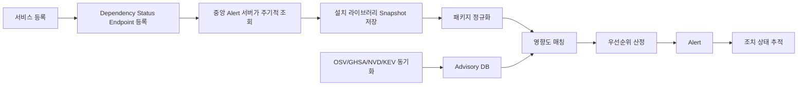
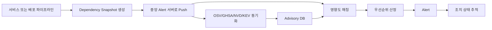

# Reported Supply Chain Alert Platform

## 1. 목적

이 시스템은 특정 라이브러리나 패키지를 직접 분석해서 보안 위협을 새로 탐지하지 않는다.

대신 신뢰 가능한 외부 보안 소스에 이미 보고된 공급망 보안 이슈를 빠르게 수집하고, 등록된 서비스의 의존성 정보와 매칭하여 영향 여부와 조치 우선순위를 알려준다.

핵심 목표는 다음과 같다.

- 보고된 취약점과 악성 패키지 정보를 빠르게 수집한다.
- 등록된 서비스가 해당 이슈의 영향을 받는지 확인한다.
- 운영 서비스에 영향이 있는 경우 빠르게 alert을 보낸다.
- 보안 담당자와 서비스 담당자가 조치 상태를 추적할 수 있게 한다.

## 2. 제품 정의

```text
클라우드에 별도로 운영되는 중앙 alert 서버가
각 서비스에서 제공하는 dependency status 정보를 기준으로
OSV, CVE, GHSA, CISA KEV 등 외부에 보고된 보안 이슈를 매칭하고
영향받는 서비스와 조치 우선순위를 알려주는 SCA alert platform
```

이 제품의 성격은 "탐지 엔진"보다는 "보안 인텔리전스 매칭 및 알림 시스템"에 가깝다.

각 서비스는 자신에게 설치되어 있거나 배포 artifact에 포함된 라이브러리 목록을 status endpoint로 제공한다.
중앙 alert 서버는 이 endpoint를 주기적으로 조회하거나 서비스가 push한 dependency snapshot을 받아서 advisory와 매칭한다.

## 3. 명확한 범위

### 포함 범위

- 서비스별 의존성 수집
- 각 서비스의 dependency status 수집
- 서비스가 제공한 설치 라이브러리 목록 정규화
- 외부 advisory 데이터 동기화
- 패키지명, ecosystem, version range 기반 영향 매칭
- 서비스별 영향도 산정
- severity 및 운영 영향도 기반 alert 생성
- 조치 상태 추적

### 제외 범위

- 패키지 코드 정적 분석
- 악성 스크립트 직접 판정
- obfuscation 탐지
- maintainer 계정 탈취 추정
- 신규 릴리즈 이상 징후 분석
- 자체 malware classification
- 자체 CVE 발굴

운영 원칙은 다음과 같다.

```text
우리는 공격을 직접 발견하지 않는다.
이미 신뢰 가능한 소스에 보고된 공격/취약점을
우리 서비스 자산과 빠르게 연결한다.
```

## 4. 주요 데이터 소스

이 시스템은 직접 취약점이나 악성 여부를 판정하지 않으므로, 아래 외부 소스를 주기적으로 수집한다.
확정 가능한 공식 수집 경로가 있는 항목은 `CONFIRMED`, 조직 내부 결정이 필요한 항목은 `REQUIRED`로 표시한다.

| 소스 | 수집 대상 | 수집 방법 | 상태 |
|---|---|---|---|
| OSV.dev | 오픈소스 패키지 취약점, affected range, fixed version | `POST https://api.osv.dev/v1/querybatch`, `GET https://api.osv.dev/v1/vulns/{id}` | CONFIRMED |
| CISA KEV | 실제 악용이 확인된 CVE | CISA KEV catalog의 JSON/CSV feed | CONFIRMED |
| OpenSSF Malicious Packages | 악성 패키지 보고, `MAL-*` record | `https://github.com/ossf/malicious-packages` 또는 OSV API | CONFIRMED |
| GitHub Security Advisory | GHSA, CVE alias, package advisory, malware advisory | `GET https://api.github.com/advisories`, malware는 `type=malware` | CONFIRMED |
| NVD CVE API 2.0 | CVE, CVSS, CWE, CPE, reference, change history | `GET https://services.nvd.nist.gov/rest/json/cves/2.0` | CONFIRMED |
| 내부 서비스 catalog | service_id, owner, oncall, alert channel | 조직 내부 authoritative source 결정 필요 | REQUIRED |
| 내부 dependency snapshot | endpoint polling 또는 CI/CD push | 서비스별 제공 방식 결정 필요 | REQUIRED |
| 내부 package registry | private package namespace, registry metadata | registry URL 및 접근 권한 결정 필요 | REQUIRED |

### OSV

오픈소스 패키지 취약점 매칭의 기본 소스로 사용한다.

- npm, PyPI, Maven, Go, Cargo 등 주요 ecosystem 지원
- package name, ecosystem, version 기반 매칭에 적합
- CVE가 없는 GHSA 또는 ecosystem advisory도 포함 가능
- 악성 패키지 정보 연계에도 활용 가능

### GitHub Security Advisory

GitHub 생태계의 advisory 정보를 보강 데이터로 사용한다.

- GHSA ID 기반 advisory 수집
- CVE가 아직 없거나 별도로 관리되는 advisory 대응
- GitHub repository 및 Dependabot 흐름과 연결하기 좋음

### NVD / CVE

표준 CVE 데이터를 보강 소스로 사용한다.

- CVE ID
- CVSS
- CWE
- CPE
- reference URL

단, 오픈소스 패키지 버전 매칭은 NVD만으로는 부족할 수 있으므로 OSV 또는 GHSA와 함께 사용한다.

### CISA KEV

실제로 공격에 악용 중인 취약점 여부를 판단하는 우선순위 데이터로 사용한다.

- KEV에 포함된 CVE는 우선순위를 높인다.
- 운영 서비스에 영향이 있으면 Critical alert 후보가 된다.

### OpenSSF Malicious Packages

악성 패키지로 보고된 항목을 수집하는 데 사용한다.

- typosquatting
- dependency confusion
- credential stealing package
- malicious install script가 보고된 package

## 5. 시스템 흐름



서비스가 외부에서 접근 가능한 endpoint를 열기 어려운 경우에는 push 방식도 허용한다.



## 6. 서비스 등록 모델

서비스는 다음 정보를 가진다.

```text
service_id
service_name
environment: prod | stage | dev
owner_team
repository_url
status_endpoint_url
status_auth_type: bearer_token | mtls | hmac | none
runtime_type
internet_facing: true | false
business_criticality: critical | high | medium | low
alert_channel
oncall_contact
poll_interval_seconds
freshness_threshold_seconds
```

초기 버전에서는 각 서비스가 제공하는 dependency status endpoint를 우선 지원한다.

repository, lockfile 업로드, 컨테이너 이미지 SBOM 수집은 보조 입력 수단으로 확장할 수 있다.

## 7. Dependency Status Endpoint

각 서비스는 중앙 alert 서버가 접근 가능한 endpoint를 제공한다.

예시:

```text
GET /.well-known/sca/dependencies
GET /internal/sca/dependencies
GET /status/dependencies
```

endpoint는 현재 실행 중인 서비스 또는 현재 배포 artifact에 포함된 라이브러리 목록을 반환한다.
가능하면 빌드 시점에 생성한 dependency snapshot을 런타임에서 그대로 제공하는 방식을 권장한다.
런타임 요청 시마다 package manager를 실행해서 목록을 생성하면 성능과 안정성 문제가 생길 수 있다.

### 응답 예시

```json
{
  "schema_version": "1.0",
  "service_id": "payment-api",
  "service_name": "Payment API",
  "environment": "prod",
  "snapshot_id": "2026-06-10T10:20:30Z-9f42c1",
  "generated_at": "2026-06-10T10:20:30Z",
  "runtime": {
    "language": "node",
    "version": "22.4.0"
  },
  "artifact": {
    "type": "container_image",
    "name": "registry.example.com/payment-api",
    "digest": "sha256:..."
  },
  "dependencies": [
    {
      "ecosystem": "npm",
      "name": "lodash",
      "version": "4.17.20",
      "purl": "pkg:npm/lodash@4.17.20",
      "scope": "production",
      "direct": false,
      "source": "package-lock.json",
      "dependency_path": ["payment-api", "express", "lodash"]
    },
    {
      "ecosystem": "npm",
      "name": "express",
      "version": "4.18.2",
      "purl": "pkg:npm/express@4.18.2",
      "scope": "production",
      "direct": true,
      "source": "package-lock.json"
    }
  ]
}
```

### 최소 필드

MVP에서 반드시 필요한 필드는 다음과 같다.

```text
service_id
schema_version
environment
generated_at
dependencies[].ecosystem
dependencies[].name
dependencies[].version
```

### 권장 필드

우선순위 산정과 운영 추적을 위해 다음 필드를 추가하는 것이 좋다.

```text
snapshot_id
runtime.language
runtime.version
artifact.type
artifact.name
artifact.digest
dependencies[].purl
dependencies[].scope
dependencies[].direct
dependencies[].source
dependencies[].dependency_path
```

### 보안 요구사항

dependency status endpoint는 공격자에게 유용한 내부 기술 스택 정보를 제공할 수 있다.
따라서 공개 인터넷에 무인증으로 노출하지 않는 것이 원칙이다.

권장 방식은 다음과 같다.

- 사내망 또는 VPC 내부에서만 접근 허용
- 중앙 alert 서버의 고정 egress IP allowlist 적용
- bearer token, mTLS, HMAC signature 중 하나 이상 사용
- 응답에는 secret, 환경 변수, private registry token을 절대 포함하지 않음
- endpoint 접근 로그를 남김
- service_id spoofing 방지를 위해 등록된 endpoint와 응답 service_id를 검증

## 8. 중앙 Alert 서버 역할

중앙 alert 서버는 클라우드에 별도 서비스로 운영된다.
초기 구현의 영속 저장소는 PostgreSQL을 사용한다.

주요 역할은 다음과 같다.

- 등록된 서비스의 dependency status endpoint 관리
- endpoint 주기적 polling
- dependency snapshot 저장
- snapshot 간 변경 이력 관리
- 외부 advisory 데이터 동기화
- advisory와 dependency snapshot 매칭
- risk level 산정
- alert 발송
- impact 상태 관리

서비스 endpoint가 일시적으로 실패할 수 있으므로 polling 실패도 별도 상태로 관리한다.

```text
healthy
stale
unreachable
auth_failed
invalid_response
```

dependency snapshot이 오래된 경우에는 보안 이슈 매칭 결과의 신뢰도가 떨어지므로 별도 경고를 생성한다.

## 9. Snapshot 신뢰도와 신선도

중앙 alert 서버는 각 서비스의 dependency snapshot이 현재 배포 상태를 충분히 대표하는지 판단해야 한다.

기본 정책은 다음과 같다.

```text
fresh: now - generated_at <= freshness_threshold_seconds
stale: now - generated_at > freshness_threshold_seconds
unreachable: polling 실패
invalid: schema validation 실패
```

권장 freshness 기준은 다음과 같다.

```text
prod: 1시간
stage: 24시간
dev: 7일
```

freshness가 낮은 snapshot은 advisory 매칭 자체는 수행하되, alert 메시지에 신뢰도 경고를 포함한다.

```text
Snapshot Status: stale
Last Successful Poll: 2026-06-10T09:00:00Z
Snapshot Generated At: 2026-06-09T09:00:00Z
Warning: The affected package is based on a stale dependency snapshot.
```

서비스별로 다음 상태를 저장한다.

```text
last_poll_started_at
last_poll_finished_at
last_successful_poll_at
last_error_code
last_error_message
snapshot_status
snapshot_age_seconds
```

## 10. Endpoint Schema Versioning

dependency status endpoint는 응답 최상위에 `schema_version`을 포함한다.

```json
{
  "schema_version": "1.0"
}
```

중앙 alert 서버는 schema version별 parser와 validator를 가진다.
지원하지 않는 schema version이면 dependency snapshot을 저장하지 않고 `invalid_response`로 처리한다.

호환성 원칙은 다음과 같다.

- minor version에서는 optional field만 추가한다.
- required field 변경은 major version을 올린다.
- 중앙 alert 서버는 최소 1개 이전 major version을 일정 기간 지원한다.

## 11. 의존성 데이터 모델

서비스별 의존성은 다음 형태로 정규화한다.

```text
service_id
schema_version
snapshot_id
ecosystem
package_name
resolved_version
package_url
dependency_scope: production | development | optional | transitive
direct_dependency: true | false
dependency_path
source
artifact_digest
detected_at
```

예시:

```text
service_id: payment-api
ecosystem: npm
package_name: lodash
resolved_version: 4.17.20
package_url: pkg:npm/lodash@4.17.20
dependency_scope: production
direct_dependency: false
dependency_path: payment-api -> express -> lodash
source: package-lock.json
```

`package_url`은 package-url 표준의 purl 값을 의미한다.
advisory source 간 패키지명 표기 차이를 줄이고 SBOM/CycloneDX 연계를 쉽게 만들기 위해 권장한다.

## 12. Advisory 데이터 모델

외부 보안 이슈는 다음 형태로 정규화한다.

```text
advisory_id
source: OSV | GHSA | NVD | CISA_KEV | OpenSSF
aliases
ecosystem
package_name
affected_version_ranges
fixed_versions
severity
cvss_score
published_at
modified_at
is_known_exploited
is_malicious_package
references
summary
ingested_at
content_hash
```

예시:

```text
advisory_id: GHSA-xxxx-yyyy-zzzz
source: GHSA
aliases: CVE-2026-0000
ecosystem: npm
package_name: example-package
affected_version_ranges: < 1.2.3
fixed_versions: 1.2.3
severity: high
is_known_exploited: false
is_malicious_package: false
```

## 13. Advisory 변경 처리

advisory는 최초 수집 후에도 내용이 바뀔 수 있다.

중앙 alert 서버는 advisory의 `modified_at` 또는 normalized content hash를 기준으로 변경 여부를 감지한다.
변경이 감지되면 해당 advisory와 관련된 모든 dependency snapshot을 다시 매칭한다.

재매칭이 필요한 대표 상황은 다음과 같다.

- affected version range 변경
- fixed version 추가 또는 변경
- severity 변경
- CVE alias 추가
- CISA KEV 등재
- malicious package 플래그 추가
- advisory 철회 또는 false positive 처리

advisory 변경으로 기존 impact의 risk level이 상승하면 재알림한다.
반대로 더 이상 영향이 없으면 impact를 `resolved_by_advisory_update` 상태로 닫을 수 있다.

## 14. 영향도 매칭

매칭 기준은 다음 3가지를 기본으로 한다.

```text
ecosystem
package_name
resolved_version in affected_version_ranges
```

매칭 결과는 service impact로 저장한다.

```text
impact_id
service_id
advisory_id
package_name
resolved_version
matched_range
fixed_version
dependency_scope
environment
risk_level
status
first_detected_at
last_seen_at
snapshot_id
artifact_digest
snapshot_status
dedupe_key
```

기본 dedupe key는 다음 조합으로 생성한다.

```text
service_id
advisory_id
package_name
resolved_version
artifact_digest
environment
```

## 15. 위험도 산정

위험도는 advisory 자체의 severity와 서비스 영향도를 함께 반영한다.

기본 판단 요소는 다음과 같다.

```text
advisory_severity
is_known_exploited
is_malicious_package
environment
dependency_scope
internet_facing
business_criticality
snapshot_status
fix_available
```

### Critical

다음 중 하나에 해당하면 Critical로 본다.

- 악성 패키지로 보고된 항목이 운영 서비스에 포함됨
- CISA KEV에 포함된 CVE가 운영 서비스에 영향
- production dependency이며 severity가 critical
- fix version이 없고 운영 서비스에 영향

### High

- severity high 이상
- production dependency
- 인터넷 노출 서비스에 영향
- fix version이 존재하여 즉시 조치 가능

### Medium

- severity medium
- stage 또는 dev 환경에만 영향
- development dependency
- transitive dependency이나 운영 영향 가능성이 있음

### Low / Info

- 현재 등록 서비스에는 직접 영향 없음
- 운영 환경이 아닌 곳에만 존재
- 참고용 advisory

## 16. Alert 정책

초기 버전에서는 alert fatigue를 줄이기 위해 다음 기준을 권장한다.

### 즉시 Alert

- Critical impact 신규 발생
- High impact가 production 서비스에서 신규 발생
- 기존 Medium/High가 CISA KEV로 승격됨
- 악성 패키지 advisory가 신규 수집되고 등록 서비스와 매칭됨

### Daily Digest

- Medium 이하 신규 이슈
- dev/stage 환경에만 영향 있는 이슈
- 이미 알려진 이슈의 metadata 변경

### 중복 방지

중앙 alert 서버는 같은 dedupe key에 대해 동일한 alert을 반복 발송하지 않는다.

재알림은 다음 경우에만 수행한다.

- risk level 상승
- CISA KEV 등재
- malicious package 플래그 추가
- fixed 상태 이후 동일 문제가 다시 발견됨
- SLA 만료
- stale snapshot 상태가 일정 시간 이상 지속됨

### Alert 메시지 예시

```text
[Critical] Reported supply chain issue affects production service

Service: payment-api
Environment: prod
Package: example-package
Version: 1.0.4
Ecosystem: npm
Package URL: pkg:npm/example-package@1.0.4
Advisory: GHSA-xxxx-yyyy-zzzz
Severity: critical
Known Exploited: true
Malicious Package: false
Fixed Version: 1.0.8
Dependency Scope: production
Artifact Digest: sha256:...
Snapshot Generated At: 2026-06-10T10:20:30Z
Snapshot Status: fresh

Action:
- Upgrade example-package to 1.0.8 or later.
- Rebuild and redeploy payment-api.
- Mark the impact as fixed after verification.
```

## 17. 조치 상태

각 impact는 다음 상태를 가진다.

```text
open
acknowledged
in_progress
fixed
not_affected
accepted_risk
false_positive
resolved_by_advisory_update
```

상태 변경 시 담당자, 변경 사유, 변경 시각을 기록한다.

## 18. 자동 해결 판정

중앙 alert 서버는 새로운 snapshot이 수집될 때 기존 open impact가 해결되었는지 자동으로 확인한다.

자동 fixed 처리 조건은 다음과 같다.

- 영향받던 package가 더 이상 snapshot에 없음
- resolved version이 fixed version 이상으로 변경됨
- advisory 변경으로 현재 version이 affected range에서 제외됨

자동 fixed 처리 시에도 조치 이력을 남긴다.

```text
status: fixed
resolution_type: auto_snapshot_verification
resolved_snapshot_id
resolved_at
```

fixed 처리 후 동일 dedupe key 또는 동일 advisory/package 조합이 다시 발견되면 regression alert을 발송한다.

## 19. SLA와 Escalation

서비스 중요도와 risk level에 따라 조치 SLA를 둔다.

권장 기본값은 다음과 같다.

```text
Critical: 24시간
High: 7일
Medium: 30일
Low: 추적만 수행
```

SLA 계산은 impact가 처음 open 된 시점부터 시작한다.
`acknowledged` 또는 `in_progress` 상태여도 SLA는 중단하지 않는다.
`accepted_risk`는 승인자와 만료일을 요구한다.

SLA 초과 시 다음 순서로 escalation한다.

1. 서비스 담당 채널
2. owner team on-call
3. 보안 담당 채널
4. 조직 보안 책임자 또는 지정 escalation 채널

## 20. MVP 기능

초기 MVP는 다음 기능에 집중한다.

1. 서비스 등록
2. dependency status endpoint 등록
3. endpoint 인증 정보 관리
4. endpoint 주기적 polling
5. dependency snapshot 저장
6. snapshot freshness 판정
7. endpoint schema validation
8. 패키지 정규화
9. OSV advisory 동기화
10. CISA KEV 동기화
11. advisory 변경 감지 및 재매칭
12. advisory와 서비스 의존성 매칭
13. risk level 산정
14. alert deduplication
15. Slack 또는 webhook alert
16. impact 목록 및 상세 조회
17. endpoint 상태 조회
18. 자동 fixed 판정
19. SLA 초과 escalation

## 21. 이후 확장 기능

MVP 이후 다음 기능을 추가할 수 있다.

- GitHub Security Advisory 동기화
- NVD CVE 동기화
- 서비스 또는 CI/CD pipeline의 dependency snapshot push API
- repository 또는 lockfile 직접 등록
- 컨테이너 이미지 SBOM 수집
- CycloneDX/SPDX export
- Jira ticket 자동 생성
- VEX 상태 관리
- CI/CD gate 연동
- organization-wide vulnerable package 검색
- 동일 advisory에 영향받는 서비스 일괄 조회
- fix version 기준 자동 PR 생성

## 22. 핵심 차별점

일반적인 SCA 도구가 취약점 목록을 보여주는 데 집중한다면, 이 시스템은 다음 질문에 답하는 데 집중한다.

```text
외부에 보고된 공급망 보안 이슈가
우리의 어떤 서비스에
얼마나 심각한 영향을 주며
누가 무엇을 조치해야 하는가?
```

따라서 제품의 핵심 가치는 다음과 같다.

- 직접 탐지하지 않으므로 결과의 설명 가능성이 높다.
- 신뢰 가능한 보고 소스 기반으로 alert을 만든다.
- 서비스 영향도 중심으로 우선순위를 정한다.
- 보안팀과 서비스팀 사이의 조치 흐름을 추적한다.
