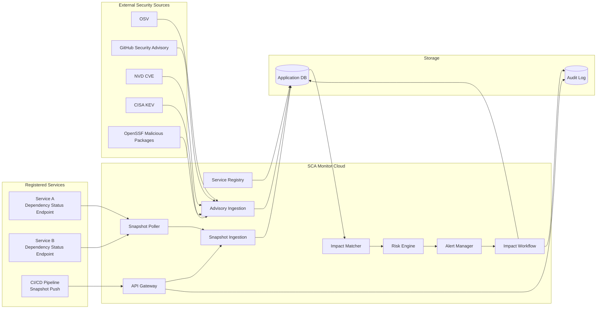
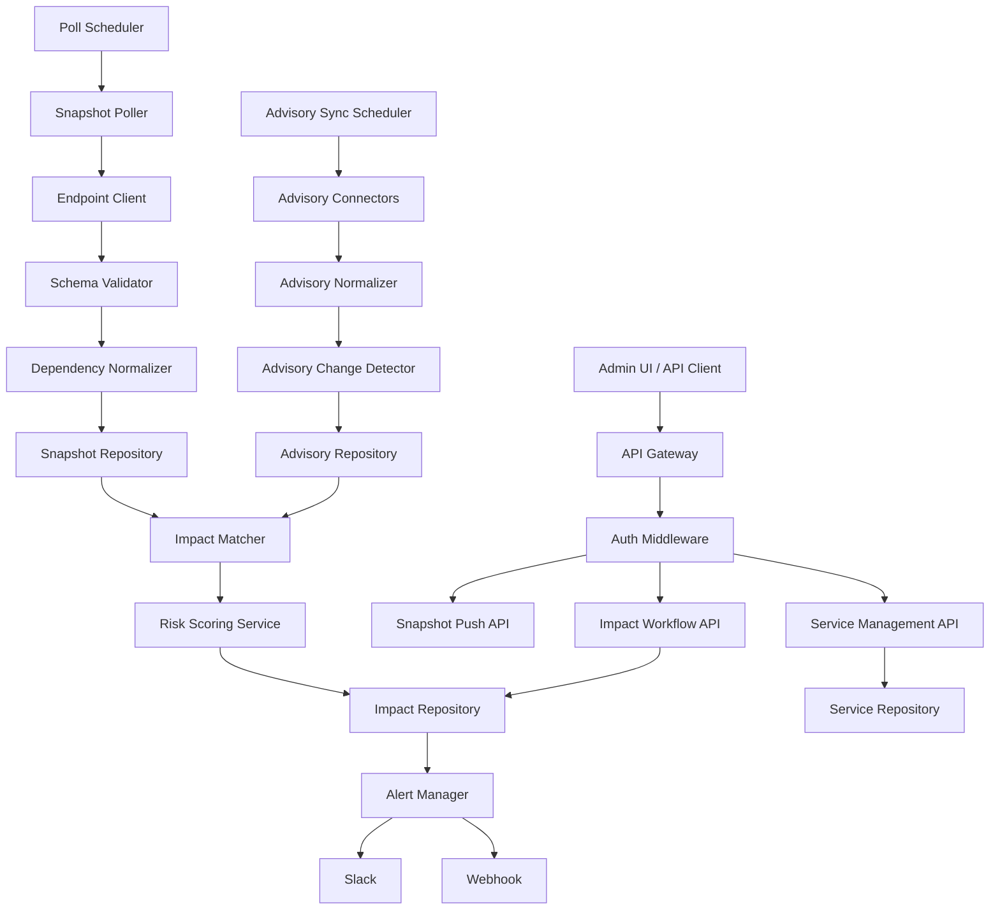
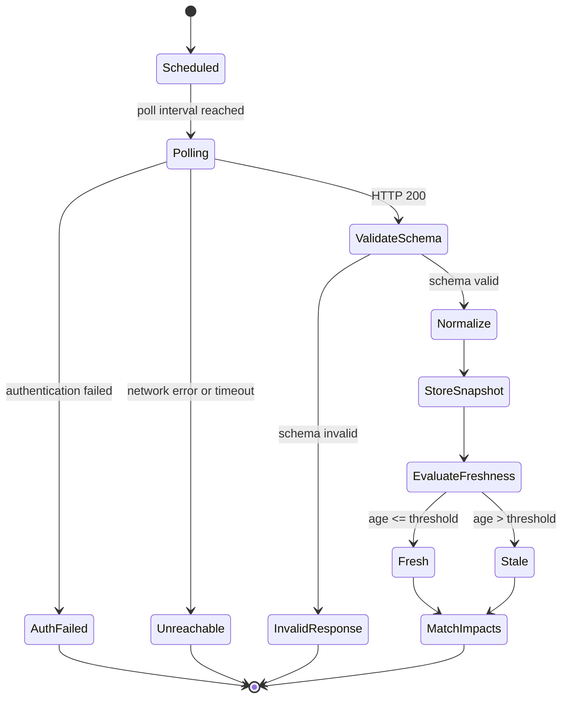
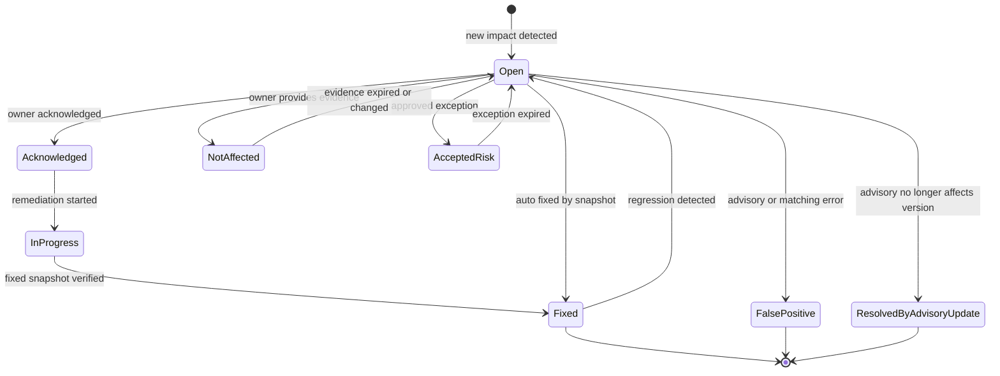
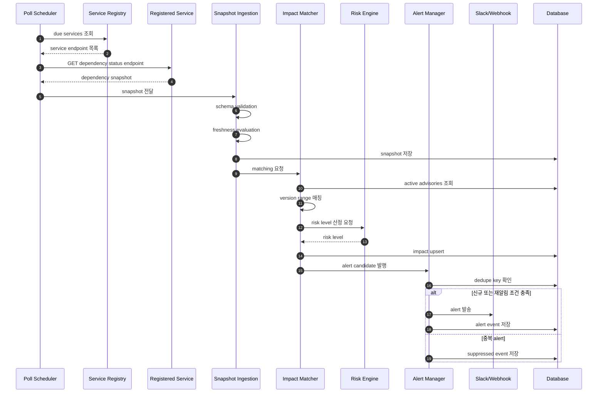
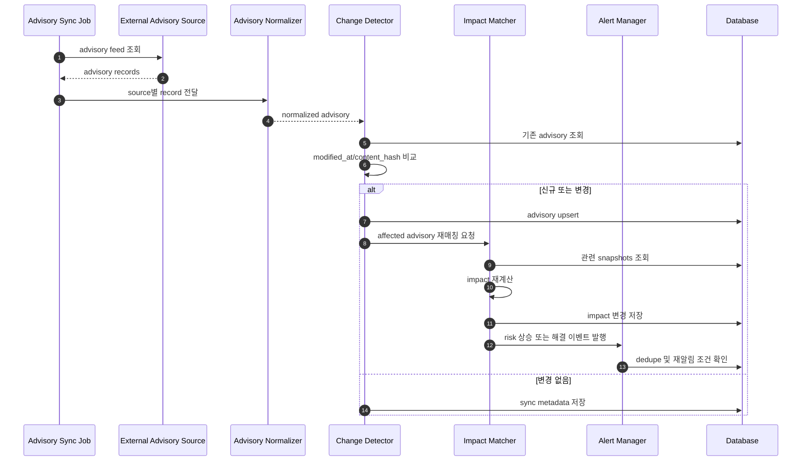
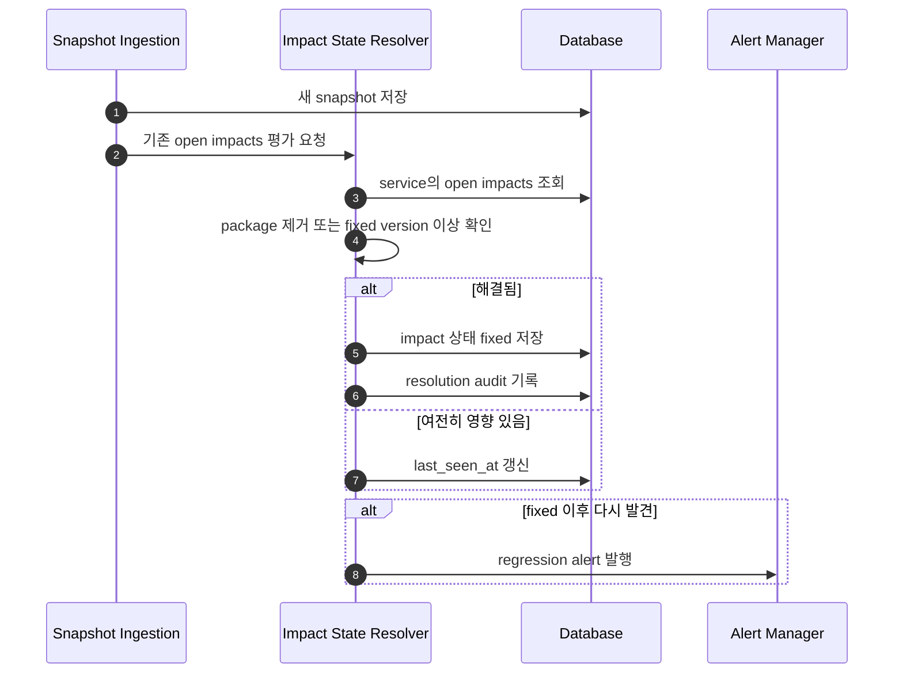
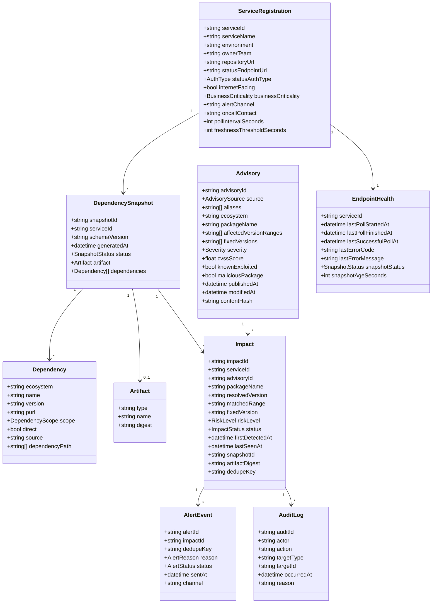
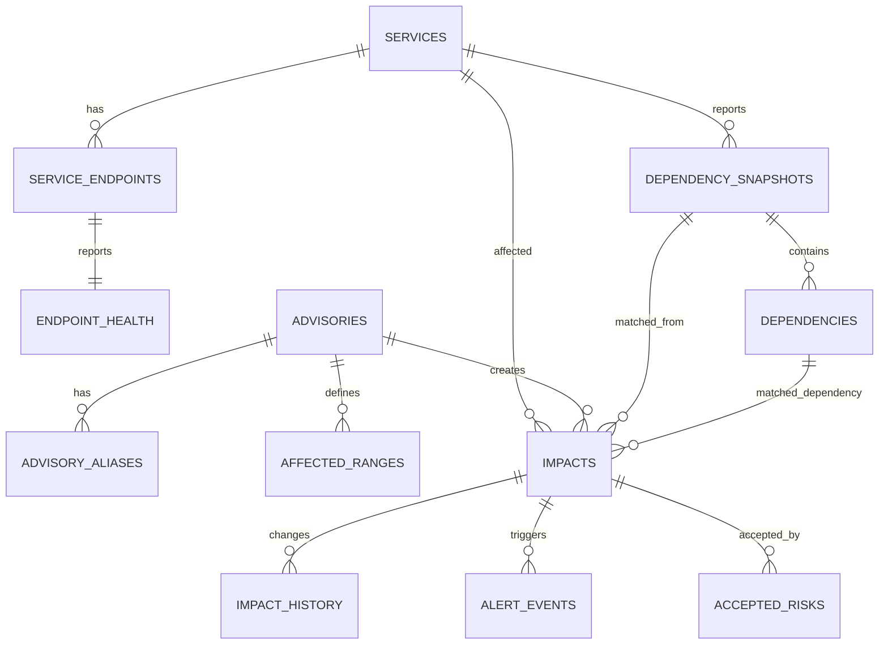

# SCA Monitor Software Design Specification

## 1. 문서 목적

이 문서는 SCA Monitor의 소프트웨어 설계를 정의한다.

SCA Monitor는 클라우드에 별도로 운영되는 중앙 alert 서버가 각 서비스의 dependency status endpoint 또는 snapshot push API를 통해 설치 라이브러리 정보를 수집하고, 외부에 이미 보고된 보안 이슈와 매칭하여 영향받는 서비스를 식별하고 alert을 발송하는 시스템이다.

이 시스템은 패키지 코드나 행위를 직접 분석하여 악성 여부를 새로 판정하지 않는다.
OSV, GitHub Security Advisory, NVD, CISA KEV, OpenSSF malicious package 등 신뢰 가능한 외부 소스에 보고된 이슈를 기준으로 서비스 영향도를 계산한다.

## 2. 설계 범위

### 포함 범위

- 서비스 등록 및 ownership 관리
- dependency status endpoint 등록 및 인증 정보 관리
- endpoint polling 및 dependency snapshot 저장
- 서비스 또는 CI/CD pipeline의 snapshot push 수신
- endpoint schema validation
- snapshot freshness 판정
- 외부 advisory source 동기화
- advisory 변경 감지 및 재매칭
- package ecosystem, name, version range 기반 영향도 매칭
- risk level 산정
- alert deduplication 및 escalation
- impact 상태 관리
- 자동 fixed 판정
- 운영 감사 로그

### 제외 범위

- 패키지 코드 정적 분석
- 악성 스크립트 직접 판정
- obfuscation 탐지
- maintainer 계정 탈취 추정
- 자체 malware classification
- 자체 CVE 발굴

## 3. 용어

| 용어 | 설명 |
|---|---|
| CSCI | Computer Software Configuration Item. 독립 배포 또는 주요 책임 단위의 소프트웨어 구성 항목 |
| CSC | Computer Software Component. CSCI 내부의 주요 기능 컴포넌트 |
| CSU | Computer Software Unit. CSC 내부의 구현 단위 |
| Advisory | 외부 보안 소스에 보고된 취약점 또는 악성 패키지 정보 |
| Dependency Snapshot | 특정 시점에 서비스가 보고한 설치 라이브러리 목록 |
| Impact | 특정 advisory가 특정 서비스의 특정 dependency에 영향을 주는 매칭 결과 |
| Freshness | snapshot이 현재 배포 상태를 대표할 수 있는 시간적 신뢰도 |
| Dedupe Key | 중복 alert 발송을 막기 위한 impact 식별 키 |
| PURL | package-url 표준 식별자. 예: `pkg:npm/lodash@4.17.20` |

## 4. 요구사항

### 4.1 기능 요구사항

| ID | 요구사항 |
|---|---|
| FR-001 | 시스템은 서비스를 등록하고 `service_id`, 환경, owner, alert channel, endpoint URL, 인증 방식, 중요도를 저장해야 한다. |
| FR-002 | 시스템은 등록된 서비스의 dependency status endpoint를 주기적으로 polling해야 한다. |
| FR-003 | 시스템은 서비스 또는 CI/CD pipeline이 dependency snapshot을 push할 수 있는 API를 제공해야 한다. |
| FR-004 | 시스템은 dependency snapshot의 `schema_version`을 검증해야 한다. |
| FR-005 | 시스템은 snapshot의 필수 필드인 `service_id`, `schema_version`, `environment`, `generated_at`, dependency의 ecosystem/name/version을 검증해야 한다. |
| FR-006 | 시스템은 endpoint 인증 실패, 연결 실패, 응답 스키마 오류를 endpoint 상태로 저장해야 한다. |
| FR-007 | 시스템은 snapshot freshness를 판단하고 `fresh`, `stale`, `unreachable`, `invalid` 상태를 관리해야 한다. |
| FR-008 | 시스템은 dependency를 ecosystem, package name, version, purl, scope, direct 여부, dependency path 기준으로 정규화해야 한다. |
| FR-009 | 시스템은 OSV advisory를 동기화해야 한다. |
| FR-010 | 시스템은 CISA KEV catalog를 동기화해야 한다. |
| FR-011 | 시스템은 GitHub Security Advisory와 NVD CVE를 확장 소스로 동기화할 수 있어야 한다. |
| FR-012 | 시스템은 advisory의 `modified_at` 또는 content hash 변경을 감지해야 한다. |
| FR-013 | advisory 변경 시 관련 snapshot과 impact를 재매칭해야 한다. |
| FR-014 | 시스템은 dependency의 ecosystem, package name, resolved version이 advisory affected range에 포함되는지 판단해야 한다. |
| FR-015 | 시스템은 service impact를 생성하고 advisory, package, version, snapshot, artifact digest, risk level, 상태를 저장해야 한다. |
| FR-016 | 시스템은 advisory severity, KEV 여부, malicious package 여부, 환경, dependency scope, internet-facing 여부, 서비스 중요도, snapshot 상태, fix availability를 기준으로 risk level을 산정해야 한다. |
| FR-017 | 시스템은 같은 dedupe key에 대해 동일 alert을 반복 발송하지 않아야 한다. |
| FR-018 | 시스템은 risk level 상승, KEV 등재, malicious flag 추가, SLA 만료, regression 발생 시 재알림해야 한다. |
| FR-019 | 시스템은 Slack 또는 webhook으로 alert을 발송해야 한다. |
| FR-020 | 시스템은 impact 상태를 `open`, `acknowledged`, `in_progress`, `fixed`, `not_affected`, `accepted_risk`, `false_positive`, `resolved_by_advisory_update`로 관리해야 한다. |
| FR-021 | 시스템은 새 snapshot 수집 시 기존 open impact가 fixed 되었는지 자동 판정해야 한다. |
| FR-022 | 시스템은 risk level별 SLA를 계산하고 초과 시 escalation해야 한다. |
| FR-023 | 시스템은 accepted risk 처리 시 승인자, 사유, 만료일을 기록해야 한다. |
| FR-024 | 시스템은 보안 및 운영 이벤트에 대한 audit log를 남겨야 한다. |
| FR-025 | 시스템은 impact, advisory, service, endpoint 상태를 조회할 수 있는 API를 제공해야 한다. |

### 4.2 비기능 요구사항

| ID | 요구사항 |
|---|---|
| NFR-001 | dependency status endpoint는 무인증 공개 인터넷 노출을 전제로 하지 않는다. |
| NFR-002 | 중앙 서버는 bearer token, mTLS, HMAC 중 하나 이상의 endpoint 인증 방식을 지원해야 한다. |
| NFR-003 | endpoint 응답에는 secret, 환경 변수, private registry token이 포함되어서는 안 된다. |
| NFR-004 | 중앙 서버는 등록된 endpoint와 응답의 `service_id`를 검증하여 spoofing을 방지해야 한다. |
| NFR-005 | prod snapshot freshness 기본값은 1시간, stage는 24시간, dev는 7일로 설정 가능해야 한다. |
| NFR-006 | advisory source 동기화 실패는 별도 운영 alert으로 노출되어야 한다. |
| NFR-007 | alert은 중복 발송을 억제하여 alert fatigue를 줄여야 한다. |
| NFR-008 | schema version 변경에 대해 최소 1개 이전 major version을 일정 기간 지원해야 한다. |
| NFR-009 | 모든 상태 변경은 감사 가능해야 한다. |
| NFR-010 | 시스템은 외부 advisory source 장애 시 기존 advisory DB로 매칭을 계속 수행해야 한다. |

## 5. 취약점 및 공격 정보 소스

이 시스템은 자체적으로 취약점이나 악성 패키지를 판정하지 않는다.
따라서 외부에 이미 보고된 advisory, malicious package report, known exploited vulnerability 정보를 정기적으로 수집한다.

### 5.1 확정 가능한 외부 소스

| 소스 ID | 소스 | 수집 대상 | 수집 방법 | 주요 매칭 키 | MVP 여부 | 확인 상태 |
|---|---|---|---|---|---|---|
| SRC-001 | OSV.dev | 오픈소스 package vulnerability, OSV ID, CVE alias, GHSA alias, affected range, fixed version | `POST https://api.osv.dev/v1/querybatch`, `POST https://api.osv.dev/v1/query`, `GET https://api.osv.dev/v1/vulns/{id}` | ecosystem, package name, version, OSV ID, aliases | 필수 | CONFIRMED |
| SRC-002 | CISA KEV | 실제 악용이 확인된 CVE, vendor/product, due date, required action | CISA KEV JSON/CSV catalog feed 수집 | CVE ID | 필수 | CONFIRMED |
| SRC-003 | GitHub Security Advisory | GHSA, CVE alias, ecosystem, package, vulnerable version range, malware advisory | `GET https://api.github.com/advisories` 사용. malware advisory는 `type=malware` 지정 필요 | GHSA ID, CVE ID, ecosystem, package name, version range | 2차 | CONFIRMED |
| SRC-004 | NVD CVE API 2.0 | CVE, CVSS, CWE, CPE, reference, change history | `GET https://services.nvd.nist.gov/rest/json/cves/2.0`, 변경 이력은 `/rest/json/cvehistory/2.0` | CVE ID, CPE, lastModified | 2차 | CONFIRMED |
| SRC-005 | OpenSSF Malicious Packages | 악성 package report, typosquatting, dependency confusion, account takeover, malicious install payload report | OpenSSF malicious-packages repository 또는 OSV API의 `MAL-*` records 수집 | MAL ID, ecosystem, package name, version, OSV format | 필수 | CONFIRMED |

### 5.2 OSV 수집 방식

OSV는 오픈소스 패키지 취약점 매칭의 1차 소스이다.
dependency snapshot의 package 목록을 batch query로 보내고, 반환된 vulnerability 목록을 normalized advisory로 저장한다.

권장 호출 방식:

```http
POST https://api.osv.dev/v1/querybatch
Content-Type: application/json
```

요청 예시:

```json
{
  "queries": [
    {
      "version": "4.17.20",
      "package": {
        "name": "lodash",
        "ecosystem": "npm"
      }
    }
  ]
}
```

단건 상세 조회:

```http
GET https://api.osv.dev/v1/vulns/{OSV_ID}
```

수집 필드:

```text
id
aliases
summary
details
affected[].package.ecosystem
affected[].package.name
affected[].ranges
affected[].versions
affected[].database_specific
severity
published
modified
references
```

설계 반영:

- OSV ID를 primary advisory ID로 저장한다.
- CVE/GHSA는 aliases로 저장한다.
- affected range는 ecosystem별 version matcher 입력으로 사용한다.
- `modified` 변경 시 advisory 재매칭을 수행한다.

### 5.3 CISA KEV 수집 방식

CISA KEV는 실제 악용 여부를 판단하는 enrichment source이다.
KEV 자체는 package version range를 제공하는 목적이 아니라, CVE가 실제 공격에 악용 중인지 판단하는 우선순위 데이터로 사용한다.

권장 수집 방식:

```text
https://www.cisa.gov/known-exploited-vulnerabilities-catalog
```

수집 형식:

```text
JSON
CSV
```

수집 필드:

```text
cveID
vendorProject
product
vulnerabilityName
dateAdded
shortDescription
requiredAction
dueDate
knownRansomwareCampaignUse
notes
```

설계 반영:

- `cveID`가 advisory aliases에 포함되면 `is_known_exploited=true`로 enrichment한다.
- prod service에 영향이 있는 KEV advisory는 Critical 후보로 승격한다.
- KEV 신규 등재 또는 KEV field 변경 시 기존 impact를 재평가한다.

### 5.4 GitHub Security Advisory 수집 방식

GitHub Security Advisory는 GHSA 및 GitHub-originated advisory를 보강하는 소스이다.
malware advisory는 기본 조회에서 제외될 수 있으므로 별도 파라미터를 사용해야 한다.

권장 호출 방식:

```http
GET https://api.github.com/advisories
Accept: application/vnd.github+json
```

malware advisory 조회:

```http
GET https://api.github.com/advisories?type=malware
Accept: application/vnd.github+json
```

필터 예시:

```text
ghsa_id
cve_id
ecosystem
severity
type=reviewed | malware | unreviewed
modified
published
```

수집 필드:

```text
ghsa_id
cve_id
url
html_url
summary
description
type
severity
source_code_location
identifiers
references
vulnerabilities[].package.ecosystem
vulnerabilities[].package.name
vulnerabilities[].vulnerable_version_range
vulnerabilities[].first_patched_version
published_at
updated_at
withdrawn_at
```

설계 반영:

- GHSA ID를 advisory ID 또는 alias로 저장한다.
- `type=malware` 결과는 `is_malicious_package=true`로 저장한다.
- `updated_at` 또는 content hash 변경 시 재매칭한다.

### 5.5 NVD CVE API 수집 방식

NVD는 CVE 표준 메타데이터, CVSS, CWE, CPE, reference를 보강하는 소스이다.
오픈소스 package version 매칭은 OSV/GHSA가 더 적합하므로, NVD는 CVE enrichment와 change history 용도로 사용한다.

권장 호출 방식:

```http
GET https://services.nvd.nist.gov/rest/json/cves/2.0
```

CVE ID 기반 조회:

```http
GET https://services.nvd.nist.gov/rest/json/cves/2.0?cveIds=CVE-2026-0000
```

변경 이력 조회:

```http
GET https://services.nvd.nist.gov/rest/json/cvehistory/2.0?cveId=CVE-2026-0000
```

수집 필드:

```text
cve.id
cve.sourceIdentifier
cve.published
cve.lastModified
cve.vulnStatus
cve.descriptions
cve.metrics
cve.weaknesses
cve.configurations
cve.references
```

설계 반영:

- CVE alias가 있는 OSV/GHSA advisory에 CVSS, CWE, references를 보강한다.
- CPE 기반 매칭은 OS/package/product 자산까지 확장할 때 사용한다.
- `lastModified` 변경 시 advisory metadata를 갱신한다.

### 5.6 OpenSSF Malicious Packages 수집 방식

OpenSSF Malicious Packages는 악성 패키지 보고 데이터의 핵심 소스이다.
보고서는 OSV format으로 제공되며 OSV API 또는 repository mirror를 통해 수집할 수 있다.

수집 방식:

```text
GitHub repository: https://github.com/ossf/malicious-packages
OSV API: https://api.osv.dev/v1/vulns/{MAL_ID}
```

예시:

```http
GET https://api.osv.dev/v1/vulns/MAL-2025-6812
```

수집 필드:

```text
id
summary
details
affected[].package.ecosystem
affected[].package.name
affected[].versions
references
database_specific
published
modified
```

설계 반영:

- `MAL-*` ID를 malicious package advisory로 저장한다.
- 매칭된 운영 서비스 impact는 Critical 후보로 분류한다.
- fixed version이 없는 경우 제거 또는 대체 패키지 사용을 action으로 제시한다.

### 5.7 REQUIRED: 사용자가 확정해야 하는 소스

다음 항목은 외부 검색만으로 확정할 수 없으므로 프로젝트 또는 조직 정책으로 결정해야 한다.

| REQUIRED ID | 항목 | 필요한 결정 |
|---|---|---|
| REQ-SRC-001 | 내부 서비스 dependency source | 각 서비스가 endpoint polling을 제공할지, CI/CD push를 제공할지, 둘 다 지원할지 결정 필요 |
| REQ-SRC-002 | 내부 package registry | private npm/PyPI/Maven registry가 있다면 registry URL, package namespace, 접근 방식 필요 |
| REQ-SRC-003 | 서비스 catalog | service_id, owner_team, oncall, alert_channel의 authoritative source가 있는지 결정 필요 |
| REQ-SRC-004 | 배포 artifact source | container image digest, release version, deployment environment를 어디서 가져올지 결정 필요 |
| REQ-SRC-005 | Slack/Webhook/Jira endpoint | alert 발송 대상과 인증 방식 결정 필요 |
| REQ-SRC-006 | accepted risk 승인 정책 | 승인자 역할, 만료일 기본값, 재승인 절차 결정 필요 |
| REQ-SRC-007 | commercial threat intelligence | Snyk, Mend, Socket, Checkmarx 등 상용 feed를 사용할지 결정 필요 |

### 5.8 Source 우선순위

MVP의 권장 우선순위는 다음과 같다.

1. OSV API
2. CISA KEV
3. OpenSSF Malicious Packages
4. GitHub Security Advisory
5. NVD CVE API
6. REQUIRED 내부 service catalog 및 dependency snapshot source

OSV와 OpenSSF Malicious Packages는 package/version 기반 매칭에 직접 사용한다.
CISA KEV와 NVD는 CVE enrichment와 risk 우선순위 보강에 사용한다.
GitHub Security Advisory는 GHSA 및 malware advisory 보강에 사용한다.

## 6. 전체 개념도



## 7. CSCI/CSC/CSU 분해

### 7.1 CSCI 목록

| CSCI ID | 이름 | 책임 | 주요 요구사항 |
|---|---|---|---|
| CSCI-001 | SCA Monitor API Server | 외부 API, 관리 API, push API, workflow API 제공 | FR-001, FR-003, FR-020, FR-023, FR-025 |
| CSCI-002 | Snapshot Collection Worker | endpoint polling, 인증, snapshot 수집, freshness 계산 | FR-002, FR-004, FR-005, FR-006, FR-007 |
| CSCI-003 | Advisory Ingestion Worker | 외부 보안 소스 동기화, advisory 변경 감지 | FR-009, FR-010, FR-011, FR-012 |
| CSCI-004 | Matching and Risk Engine | dependency-advisory 매칭, impact 생성, risk 산정, 자동 fixed 판정 | FR-013, FR-014, FR-015, FR-016, FR-021 |
| CSCI-005 | Alert and Escalation Worker | alert deduplication, 발송, SLA escalation, regression alert | FR-017, FR-018, FR-019, FR-022 |
| CSCI-006 | Persistence Layer | 데이터 저장, 조회, audit log | FR-024, FR-025, NFR-009 |

### 7.2 CSC/CSU 구성

| CSCI | CSC | CSU | 설명 |
|---|---|---|---|
| CSCI-001 | CSC-001-01 Service Management | CSU-001-01-01 ServiceController | 서비스 등록/수정/조회 API |
| CSCI-001 | CSC-001-01 Service Management | CSU-001-01-02 ServiceRegistryService | 서비스 메타데이터 검증 및 저장 |
| CSCI-001 | CSC-001-02 Snapshot Push API | CSU-001-02-01 SnapshotPushController | CI/CD 또는 서비스 push 요청 수신 |
| CSCI-001 | CSC-001-02 Snapshot Push API | CSU-001-02-02 PushAuthValidator | push API 인증 검증 |
| CSCI-001 | CSC-001-03 Impact Workflow API | CSU-001-03-01 ImpactController | impact 조회 및 상태 변경 |
| CSCI-001 | CSC-001-03 Impact Workflow API | CSU-001-03-02 RiskAcceptanceService | accepted risk 승인/만료 관리 |
| CSCI-002 | CSC-002-01 Poll Scheduler | CSU-002-01-01 PollJobScheduler | 서비스별 polling job 예약 |
| CSCI-002 | CSC-002-02 Endpoint Client | CSU-002-02-01 DependencyEndpointClient | endpoint 호출 |
| CSCI-002 | CSC-002-02 Endpoint Client | CSU-002-02-02 EndpointAuthProvider | bearer, mTLS, HMAC 인증 처리 |
| CSCI-002 | CSC-002-03 Snapshot Validation | CSU-002-03-01 SchemaValidator | schema version 및 필수 필드 검증 |
| CSCI-002 | CSC-002-03 Snapshot Validation | CSU-002-03-02 FreshnessEvaluator | freshness 상태 계산 |
| CSCI-002 | CSC-002-04 Snapshot Normalization | CSU-002-04-01 DependencyNormalizer | dependency 정규화 |
| CSCI-003 | CSC-003-01 Source Connectors | CSU-003-01-01 OsvConnector | OSV advisory 수집 |
| CSCI-003 | CSC-003-01 Source Connectors | CSU-003-01-02 CisaKevConnector | CISA KEV 수집 |
| CSCI-003 | CSC-003-01 Source Connectors | CSU-003-01-03 GhsaConnector | GHSA 수집 |
| CSCI-003 | CSC-003-01 Source Connectors | CSU-003-01-04 NvdConnector | NVD CVE 수집 |
| CSCI-003 | CSC-003-02 Advisory Normalization | CSU-003-02-01 AdvisoryNormalizer | advisory 공통 모델 변환 |
| CSCI-003 | CSC-003-02 Advisory Normalization | CSU-003-02-02 AdvisoryChangeDetector | modified_at/content hash 변경 감지 |
| CSCI-004 | CSC-004-01 Version Matching | CSU-004-01-01 EcosystemVersionRangeMatcher | ecosystem별 version range 판단 |
| CSCI-004 | CSC-004-02 Impact Management | CSU-004-02-01 ImpactMatcher | snapshot과 advisory 매칭 |
| CSCI-004 | CSC-004-02 Impact Management | CSU-004-02-02 ImpactStateResolver | 신규/기존/해결 impact 판정 |
| CSCI-004 | CSC-004-03 Risk Scoring | CSU-004-03-01 RiskScoringService | risk level 산정 |
| CSCI-004 | CSC-004-03 Risk Scoring | CSU-004-03-02 AutoResolutionService | fixed 자동 판정 |
| CSCI-005 | CSC-005-01 Alert Deduplication | CSU-005-01-01 DedupeKeyGenerator | dedupe key 생성 |
| CSCI-005 | CSC-005-01 Alert Deduplication | CSU-005-01-02 AlertSuppressionService | 중복 발송 억제 |
| CSCI-005 | CSC-005-02 Notification Delivery | CSU-005-02-01 SlackNotifier | Slack 발송 |
| CSCI-005 | CSC-005-02 Notification Delivery | CSU-005-02-02 WebhookNotifier | webhook 발송 |
| CSCI-005 | CSC-005-03 SLA Escalation | CSU-005-03-01 SlaEvaluator | SLA 만료 판단 |
| CSCI-005 | CSC-005-03 SLA Escalation | CSU-005-03-02 EscalationRouter | escalation 대상 결정 |
| CSCI-006 | CSC-006-01 Repositories | CSU-006-01-01 ServiceRepository | 서비스 저장소 |
| CSCI-006 | CSC-006-01 Repositories | CSU-006-01-02 SnapshotRepository | snapshot 저장소 |
| CSCI-006 | CSC-006-01 Repositories | CSU-006-01-03 AdvisoryRepository | advisory 저장소 |
| CSCI-006 | CSC-006-01 Repositories | CSU-006-01-04 ImpactRepository | impact 저장소 |
| CSCI-006 | CSC-006-02 Audit | CSU-006-02-01 AuditLogWriter | 감사 로그 기록 |

## 8. 논리 아키텍처



## 9. 행동 다이어그램

### 9.1 Snapshot 수집 행동



### 9.2 Impact 상태 행동



## 10. 시퀀스 다이어그램

### 10.1 Endpoint Polling 기반 수집 및 Alert



### 10.2 Advisory 변경 수집 및 재매칭



### 10.3 자동 Fixed 판정



## 11. 클래스 다이어그램



## 12. 주요 데이터 저장소

| 저장소 | 주요 엔티티 | 설명 |
|---|---|---|
| Service Registry | ServiceRegistration, EndpointAuthConfig | 서비스 메타데이터와 endpoint 인증 정보 |
| Snapshot Store | DependencySnapshot, Dependency, Artifact | 수집된 dependency snapshot 및 정규화 결과 |
| Advisory Store | Advisory, AdvisoryAlias, AffectedRange | 외부 advisory 정규화 데이터 |
| Impact Store | Impact, ImpactHistory | 서비스 영향도 매칭 결과와 상태 이력 |
| Alert Store | AlertEvent, SuppressionRecord | 발송/억제된 alert 이벤트 |
| Audit Store | AuditLog | 상태 변경, 승인, 설정 변경 감사 로그 |

## 13. PostgreSQL 데이터베이스 설계

초기 구현 데이터베이스는 PostgreSQL을 사용한다.
정형 조회와 조인에는 일반 컬럼을 사용하고, 외부 advisory 원문이나 endpoint snapshot 원문처럼 source별 구조 차이가 큰 데이터는 `jsonb`로 저장한다.

### 13.1 설계 원칙

- 모든 주요 테이블은 `uuid` primary key를 사용한다.
- 외부 시스템 식별자는 별도 unique key로 관리한다. 예: `service_id`, `advisory_id`, `snapshot_id`.
- 시간 컬럼은 `timestamptz`를 사용한다.
- source 원문 보존이 필요한 데이터는 `raw_payload jsonb`에 저장한다.
- 상태값은 PostgreSQL enum 또는 check constraint로 제한한다.
- endpoint 인증 secret은 평문 저장하지 않고 암호화된 ciphertext와 key reference만 저장한다.
- `impacts.dedupe_key`는 alert 중복 방지의 기준이므로 unique index를 둔다.

### 13.2 주요 테이블

#### services

등록된 서비스의 기준 정보이다.

| 컬럼 | 타입 | 설명 |
|---|---|---|
| id | uuid PK | 내부 식별자 |
| service_id | text unique | 외부/조직 기준 서비스 ID |
| service_name | text | 서비스명 |
| environment | text | `prod`, `stage`, `dev` |
| owner_team | text | 담당 팀 |
| repository_url | text | repository URL |
| runtime_type | text | `node`, `python`, `jvm`, `go` 등 |
| internet_facing | boolean | 인터넷 노출 여부 |
| business_criticality | text | `critical`, `high`, `medium`, `low` |
| alert_channel | text | 기본 alert 채널 |
| oncall_contact | text | on-call 연락처 |
| created_at | timestamptz | 생성 시각 |
| updated_at | timestamptz | 수정 시각 |

#### service_endpoints

dependency status endpoint와 polling 설정을 저장한다.

| 컬럼 | 타입 | 설명 |
|---|---|---|
| id | uuid PK | 내부 식별자 |
| service_id | uuid FK -> services.id | 서비스 |
| status_endpoint_url | text | dependency status endpoint |
| status_auth_type | text | `bearer_token`, `mtls`, `hmac`, `none` |
| auth_secret_ref | text | 암호화 키 또는 secret manager reference |
| encrypted_auth_config | bytea | 암호화된 인증 설정 |
| poll_interval_seconds | integer | polling 주기 |
| freshness_threshold_seconds | integer | stale 판정 기준 |
| enabled | boolean | polling 활성 여부 |
| created_at | timestamptz | 생성 시각 |
| updated_at | timestamptz | 수정 시각 |

#### endpoint_health

endpoint의 마지막 수집 상태를 저장한다.

| 컬럼 | 타입 | 설명 |
|---|---|---|
| service_endpoint_id | uuid PK/FK -> service_endpoints.id | endpoint |
| last_poll_started_at | timestamptz | 마지막 polling 시작 시각 |
| last_poll_finished_at | timestamptz | 마지막 polling 종료 시각 |
| last_successful_poll_at | timestamptz | 마지막 성공 시각 |
| last_error_code | text | 오류 코드 |
| last_error_message | text | 오류 메시지 |
| snapshot_status | text | `fresh`, `stale`, `unreachable`, `auth_failed`, `invalid_response` |
| snapshot_age_seconds | integer | snapshot age |
| updated_at | timestamptz | 수정 시각 |

#### dependency_snapshots

서비스가 보고한 dependency snapshot의 header와 원문을 저장한다.

| 컬럼 | 타입 | 설명 |
|---|---|---|
| id | uuid PK | 내부 식별자 |
| snapshot_id | text | 서비스가 제공한 snapshot ID |
| service_id | uuid FK -> services.id | 서비스 |
| schema_version | text | endpoint schema version |
| environment | text | snapshot 환경 |
| generated_at | timestamptz | 서비스가 snapshot을 생성한 시각 |
| collected_at | timestamptz | 중앙 서버가 수집한 시각 |
| source_type | text | `poll`, `push` |
| snapshot_status | text | `fresh`, `stale`, `invalid` |
| artifact_type | text | `container_image`, `jar`, `lambda`, 기타 |
| artifact_name | text | artifact 이름 |
| artifact_digest | text | image digest 또는 artifact hash |
| raw_payload | jsonb | 원본 snapshot |
| created_at | timestamptz | 생성 시각 |

권장 unique constraint:

```sql
unique (service_id, snapshot_id)
```

#### dependencies

정규화된 dependency 목록이다.

| 컬럼 | 타입 | 설명 |
|---|---|---|
| id | uuid PK | 내부 식별자 |
| snapshot_id | uuid FK -> dependency_snapshots.id | snapshot |
| ecosystem | text | `npm`, `PyPI`, `Maven`, `Go`, `crates.io` 등 |
| package_name | text | package 이름 |
| resolved_version | text | 설치된 버전 |
| package_url | text | purl |
| dependency_scope | text | `production`, `development`, `optional`, `transitive` |
| direct_dependency | boolean | direct dependency 여부 |
| dependency_path | text[] | dependency path |
| source | text | lockfile 또는 source |
| created_at | timestamptz | 생성 시각 |

권장 인덱스:

```sql
create index idx_dependencies_lookup
  on dependencies (ecosystem, package_name, resolved_version);

create index idx_dependencies_snapshot
  on dependencies (snapshot_id);

create index idx_dependencies_purl
  on dependencies (package_url);
```

#### advisories

외부 소스에서 수집한 advisory의 공통 header이다.

| 컬럼 | 타입 | 설명 |
|---|---|---|
| id | uuid PK | 내부 식별자 |
| advisory_id | text unique | OSV, GHSA, CVE, MAL 등 source ID |
| source | text | `OSV`, `GHSA`, `NVD`, `CISA_KEV`, `OpenSSF` |
| summary | text | 요약 |
| details | text | 상세 설명 |
| severity | text | `critical`, `high`, `medium`, `low`, `unknown` |
| cvss_score | numeric(3,1) | CVSS |
| published_at | timestamptz | 공개 시각 |
| modified_at | timestamptz | source 수정 시각 |
| ingested_at | timestamptz | 수집 시각 |
| withdrawn_at | timestamptz | 철회 시각 |
| is_known_exploited | boolean | CISA KEV 여부 |
| is_malicious_package | boolean | 악성 패키지 여부 |
| content_hash | text | normalized content hash |
| raw_payload | jsonb | 원본 advisory |

#### advisory_aliases

advisory의 CVE, GHSA, OSV alias를 저장한다.

| 컬럼 | 타입 | 설명 |
|---|---|---|
| id | uuid PK | 내부 식별자 |
| advisory_id | uuid FK -> advisories.id | advisory |
| alias_type | text | `CVE`, `GHSA`, `OSV`, `MAL` |
| alias_value | text | alias 값 |

권장 unique constraint:

```sql
unique (advisory_id, alias_value)
```

#### affected_ranges

advisory가 영향을 주는 package와 version range이다.

| 컬럼 | 타입 | 설명 |
|---|---|---|
| id | uuid PK | 내부 식별자 |
| advisory_id | uuid FK -> advisories.id | advisory |
| ecosystem | text | ecosystem |
| package_name | text | package 이름 |
| package_url | text | purl 또는 purl prefix |
| version_range | text | affected range expression |
| fixed_versions | text[] | fixed version 목록 |
| raw_range | jsonb | source별 range 원문 |

권장 인덱스:

```sql
create index idx_affected_ranges_lookup
  on affected_ranges (ecosystem, package_name);
```

#### impacts

advisory와 서비스 dependency의 매칭 결과이다.
운영상 가장 중요한 테이블이다.

| 컬럼 | 타입 | 설명 |
|---|---|---|
| id | uuid PK | 내부 식별자 |
| service_id | uuid FK -> services.id | 영향 서비스 |
| advisory_id | uuid FK -> advisories.id | advisory |
| dependency_id | uuid FK -> dependencies.id | 매칭 dependency |
| snapshot_id | uuid FK -> dependency_snapshots.id | 매칭 snapshot |
| package_name | text | package 이름 |
| resolved_version | text | 영향 버전 |
| matched_range | text | 매칭된 affected range |
| fixed_version | text | 권장 fixed version |
| dependency_scope | text | dependency scope |
| environment | text | 환경 |
| risk_level | text | `critical`, `high`, `medium`, `low`, `info` |
| risk_reason | text | risk 산정 사유 |
| status | text | impact 상태 |
| first_detected_at | timestamptz | 최초 탐지 시각 |
| last_seen_at | timestamptz | 마지막 확인 시각 |
| resolved_at | timestamptz | 해결 시각 |
| snapshot_status | text | snapshot 상태 |
| artifact_digest | text | artifact digest |
| dedupe_key | text | alert dedupe key |
| created_at | timestamptz | 생성 시각 |
| updated_at | timestamptz | 수정 시각 |

권장 unique constraint:

```sql
unique (dedupe_key)
```

권장 인덱스:

```sql
create index idx_impacts_service_status
  on impacts (service_id, status, risk_level);

create index idx_impacts_advisory
  on impacts (advisory_id);

create index idx_impacts_open_sla
  on impacts (status, risk_level, first_detected_at)
  where status in ('open', 'acknowledged', 'in_progress');
```

#### impact_history

impact 상태 변경 이력이다.

| 컬럼 | 타입 | 설명 |
|---|---|---|
| id | uuid PK | 내부 식별자 |
| impact_id | uuid FK -> impacts.id | impact |
| from_status | text | 이전 상태 |
| to_status | text | 변경 상태 |
| actor | text | 변경자 |
| reason | text | 변경 사유 |
| metadata | jsonb | 추가 정보 |
| created_at | timestamptz | 생성 시각 |

#### alert_events

발송 또는 억제된 alert 이벤트이다.

| 컬럼 | 타입 | 설명 |
|---|---|---|
| id | uuid PK | 내부 식별자 |
| impact_id | uuid FK -> impacts.id | impact |
| dedupe_key | text | dedupe key |
| reason | text | `new`, `risk_escalated`, `kev_added`, `sla_expired`, `regression`, `stale_snapshot` |
| status | text | `sent`, `suppressed`, `failed`, `retrying` |
| channel_type | text | `slack`, `webhook`, `email` |
| channel_target | text | 발송 대상 |
| payload | jsonb | alert payload |
| error_message | text | 실패 메시지 |
| sent_at | timestamptz | 발송 시각 |
| created_at | timestamptz | 생성 시각 |

#### accepted_risks

accepted risk 승인 정보를 별도 관리한다.

| 컬럼 | 타입 | 설명 |
|---|---|---|
| id | uuid PK | 내부 식별자 |
| impact_id | uuid FK -> impacts.id | impact |
| approved_by | text | 승인자 |
| reason | text | 승인 사유 |
| expires_at | timestamptz | 만료일 |
| revoked_at | timestamptz | 철회일 |
| created_at | timestamptz | 생성 시각 |

#### audit_logs

감사 로그이다.

| 컬럼 | 타입 | 설명 |
|---|---|---|
| id | uuid PK | 내부 식별자 |
| actor | text | 사용자 또는 시스템 actor |
| action | text | 수행 작업 |
| target_type | text | 대상 타입 |
| target_id | text | 대상 ID |
| reason | text | 사유 |
| before | jsonb | 변경 전 |
| after | jsonb | 변경 후 |
| occurred_at | timestamptz | 발생 시각 |

### 13.3 ERD



### 13.4 Partition 및 Retention

초기 MVP에서는 단일 테이블로 시작한다.
운영 데이터가 증가하면 다음 테이블은 월 단위 range partition을 고려한다.

- `dependency_snapshots`
- `dependencies`
- `alert_events`
- `audit_logs`

권장 retention:

| 데이터 | 보존 기간 |
|---|---|
| active service metadata | 삭제 전까지 |
| latest dependency snapshot | 삭제 전까지 |
| historical dependency snapshots | 90일 |
| active/open impacts | 해결 후에도 보존 |
| fixed impacts | 1년 |
| alert events | 1년 |
| audit logs | 3년 또는 조직 정책 |
| advisory data | 삭제하지 않음. withdrawn도 상태로 보존 |

### 13.5 PostgreSQL 확장

권장 확장은 다음과 같다.

```sql
create extension if not exists pgcrypto;
```

`pgcrypto`는 UUID 생성 또는 일부 암호화 보조 기능에 사용할 수 있다.
다만 endpoint 인증 secret은 애플리케이션 레벨 암호화 또는 cloud secret manager 사용을 우선한다.

## 14. 인터페이스 설계

### 14.1 Dependency Status Endpoint

서비스가 중앙 alert 서버에 제공하는 endpoint이다.

```http
GET /.well-known/sca/dependencies
Authorization: Bearer <token>
```

응답 필수 필드:

```json
{
  "schema_version": "1.0",
  "service_id": "payment-api",
  "environment": "prod",
  "generated_at": "2026-06-10T10:20:30Z",
  "dependencies": [
    {
      "ecosystem": "npm",
      "name": "lodash",
      "version": "4.17.20"
    }
  ]
}
```

### 14.2 Snapshot Push API

endpoint 공개가 어려운 서비스 또는 CI/CD pipeline이 중앙 서버로 snapshot을 push한다.

```http
POST /api/v1/snapshots
Authorization: Bearer <token>
Content-Type: application/json
```

요청 body는 dependency status endpoint 응답 schema와 동일하다.

### 14.3 Impact Workflow API

```http
GET /api/v1/impacts?service_id=payment-api&status=open
PATCH /api/v1/impacts/{impact_id}/status
```

상태 변경 요청 예시:

```json
{
  "status": "accepted_risk",
  "reason": "Compensating control exists",
  "approved_by": "security-owner@example.com",
  "expires_at": "2026-07-10T00:00:00Z"
}
```

## 15. Risk 산정 설계

초기 구현은 rule-based scoring으로 시작한다.

| 조건 | 효과 |
|---|---|
| malicious package reported | Critical |
| CISA KEV 포함 및 prod 영향 | Critical |
| advisory severity critical 및 production dependency | Critical |
| advisory severity high 및 production dependency | High |
| internet-facing 서비스 영향 | risk 1단계 상승 후보 |
| business criticality critical | risk 1단계 상승 후보 |
| dev dependency | risk 1단계 하향 후보 |
| stale snapshot | alert에 신뢰도 경고 추가 |
| fix version 없음 | 조치 난이도 표시 및 우선순위 보강 |

Risk level은 다음 순서로 계산한다.

1. advisory severity를 기본 risk로 변환한다.
2. malicious package 또는 KEV 조건을 먼저 적용한다.
3. environment, dependency scope, internet-facing, business criticality를 반영한다.
4. snapshot freshness를 별도 confidence flag로 추가한다.
5. 최종 `risk_level`과 `risk_reason`을 impact에 저장한다.

## 16. Alert 설계

### 16.1 Dedupe Key

```text
service_id
advisory_id
package_name
resolved_version
artifact_digest
environment
```

### 16.2 재알림 조건

- risk level 상승
- CISA KEV 등재
- malicious package flag 추가
- fixed 이후 regression 발생
- SLA 만료
- stale snapshot 장기 지속

### 16.3 Alert Payload

```json
{
  "risk_level": "critical",
  "service_id": "payment-api",
  "environment": "prod",
  "package": "example-package",
  "version": "1.0.4",
  "purl": "pkg:npm/example-package@1.0.4",
  "advisory_id": "GHSA-xxxx-yyyy-zzzz",
  "known_exploited": true,
  "malicious_package": false,
  "fixed_version": "1.0.8",
  "snapshot_status": "fresh",
  "action": "Upgrade example-package to 1.0.8 or later."
}
```

## 17. 보안 설계

- endpoint 인증 정보는 암호화 저장한다.
- endpoint 호출 시 service registry의 endpoint URL과 응답 `service_id`를 검증한다.
- mTLS 사용 시 인증서 subject 또는 SAN과 service registration을 매칭한다.
- HMAC 사용 시 timestamp와 nonce를 포함하여 replay를 방지한다.
- dependency snapshot에는 secret, 환경 변수, token, private registry credential을 포함하지 않는다.
- impact 상태 변경과 accepted risk 승인은 audit log에 남긴다.
- alert channel 설정 변경은 감사 대상이다.

## 18. 장애 및 예외 처리

| 상황 | 처리 |
|---|---|
| endpoint timeout | endpoint 상태를 `unreachable`로 저장하고 다음 주기에 재시도 |
| endpoint auth 실패 | `auth_failed` 저장 및 owner에게 설정 오류 alert |
| schema validation 실패 | `invalid_response` 저장 및 snapshot 폐기 |
| snapshot stale | 기존 snapshot으로 매칭하되 alert에 stale 경고 포함 |
| advisory source 장애 | 마지막 정상 advisory DB로 매칭 지속 |
| alert 발송 실패 | retry 후 실패 이벤트 저장 |
| advisory 철회 | 관련 impact를 `resolved_by_advisory_update`로 전환 가능 |

## 19. 요구사항 추적성

| 요구사항 | 관련 CSCI | 관련 설계 |
|---|---|---|
| FR-001 | CSCI-001, CSCI-006 | Service Management, Service Registry |
| FR-002 | CSCI-002 | Poll Scheduler, Endpoint Client |
| FR-003 | CSCI-001 | Snapshot Push API |
| FR-004, FR-005 | CSCI-002 | Schema Validator |
| FR-006, FR-007 | CSCI-002, CSCI-006 | EndpointHealth, FreshnessEvaluator |
| FR-008 | CSCI-002 | DependencyNormalizer |
| FR-009, FR-010, FR-011 | CSCI-003 | Advisory Connectors |
| FR-012, FR-013 | CSCI-003, CSCI-004 | Change Detector, Impact Matcher |
| FR-014, FR-015 | CSCI-004 | Version Matching, Impact Management |
| FR-016 | CSCI-004 | Risk Scoring Service |
| FR-017, FR-018, FR-019 | CSCI-005 | Alert Deduplication, Notification Delivery |
| FR-020, FR-023 | CSCI-001, CSCI-006 | Impact Workflow API, Audit Log |
| FR-021 | CSCI-004 | AutoResolutionService |
| FR-022 | CSCI-005 | SLA Escalation |
| FR-024, FR-025 | CSCI-001, CSCI-006 | Audit Store, Query APIs |
| NFR-001 to NFR-004 | CSCI-001, CSCI-002 | Auth Middleware, EndpointAuthProvider |
| NFR-005 to NFR-010 | CSCI-002 to CSCI-006 | Freshness, Sync Health, Audit, Persistence |

## 20. MVP 구현 순서

1. Service Registry와 dependency status endpoint 등록 API
2. Snapshot schema v1.0 validator
3. endpoint polling worker
4. snapshot 저장 및 freshness 계산
5. OSV connector
6. CISA KEV connector
7. advisory normalization 및 변경 감지
8. ecosystem별 version range matcher
9. impact 생성 및 risk scoring
10. alert deduplication
11. Slack/webhook notifier
12. impact workflow API
13. 자동 fixed 판정
14. SLA escalation
15. audit log
