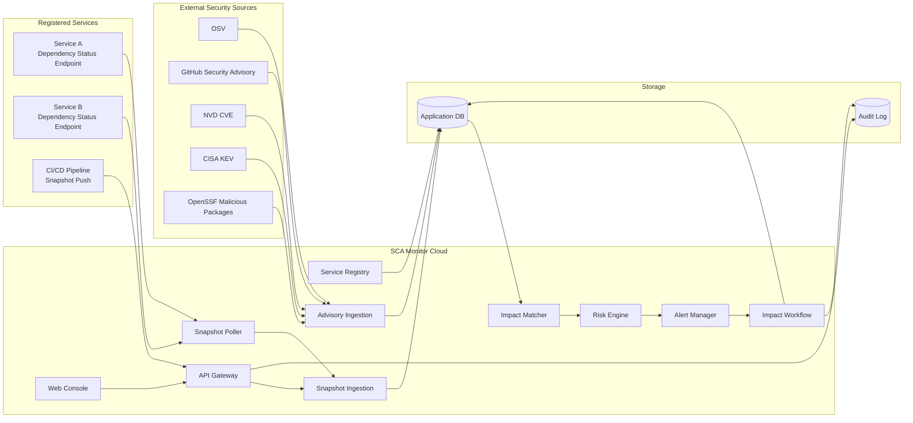
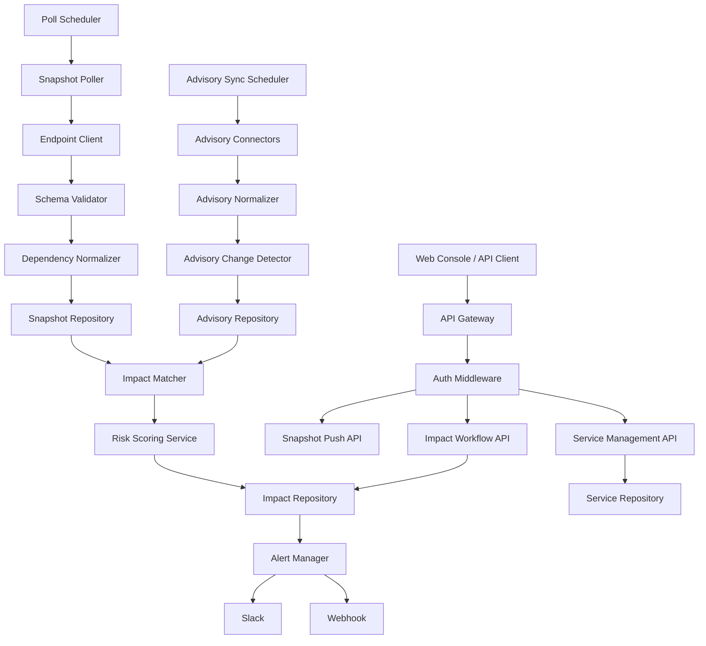
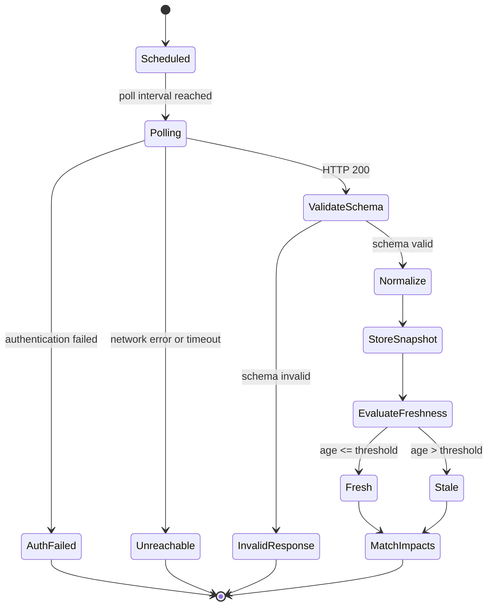
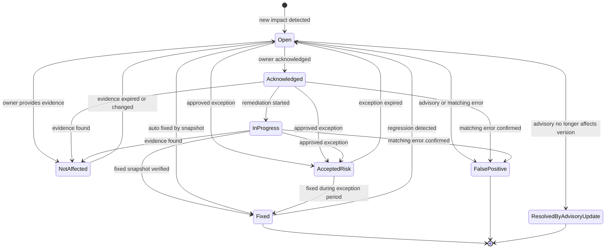
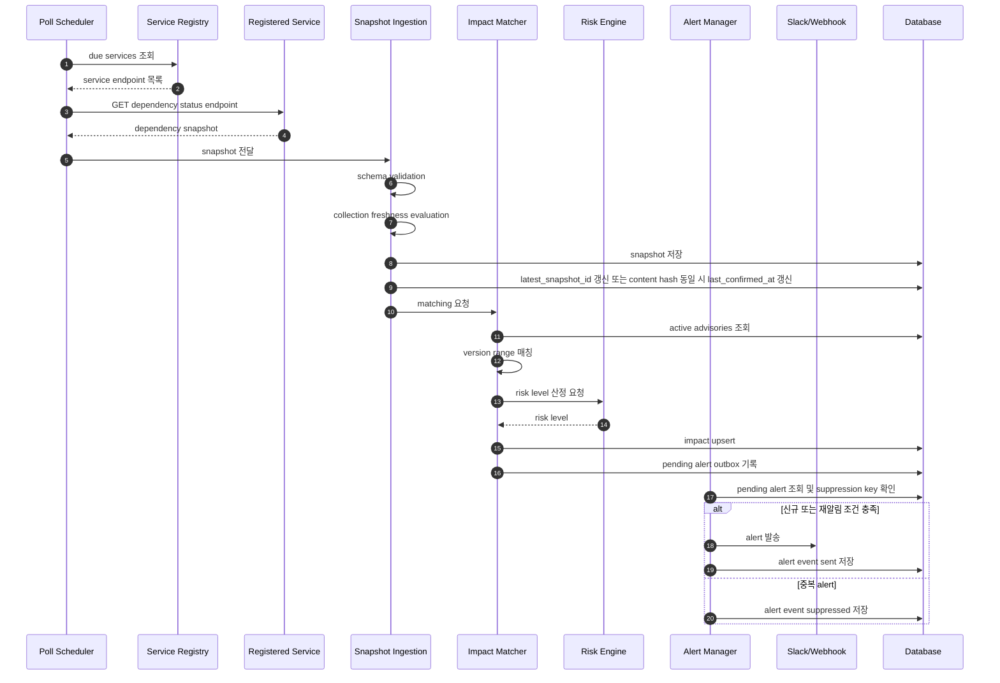
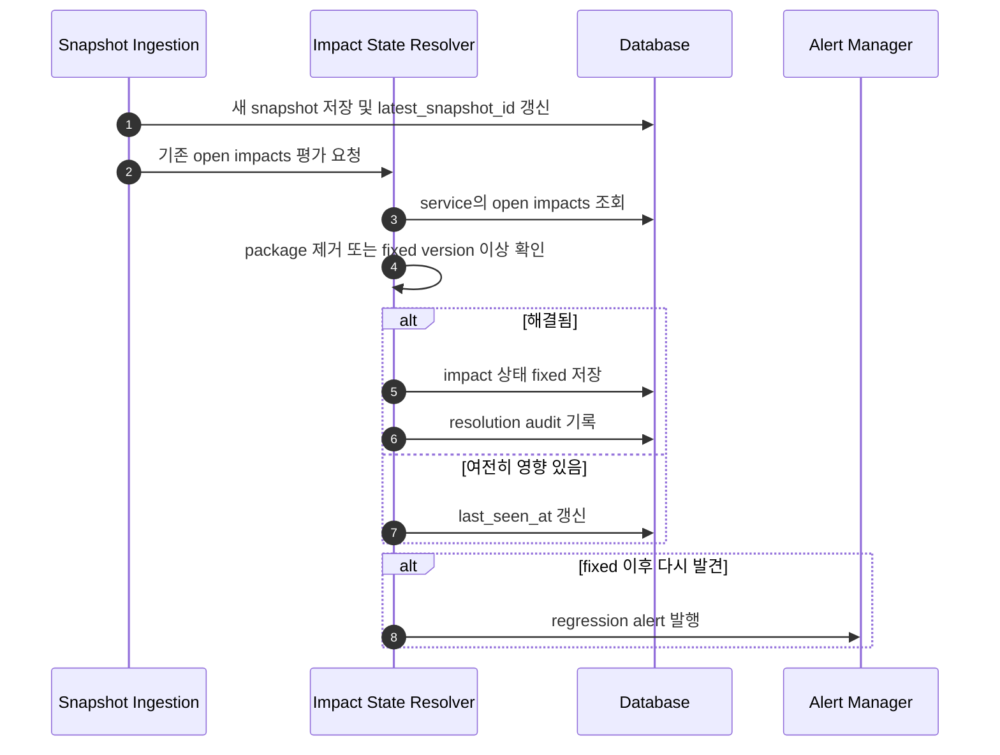
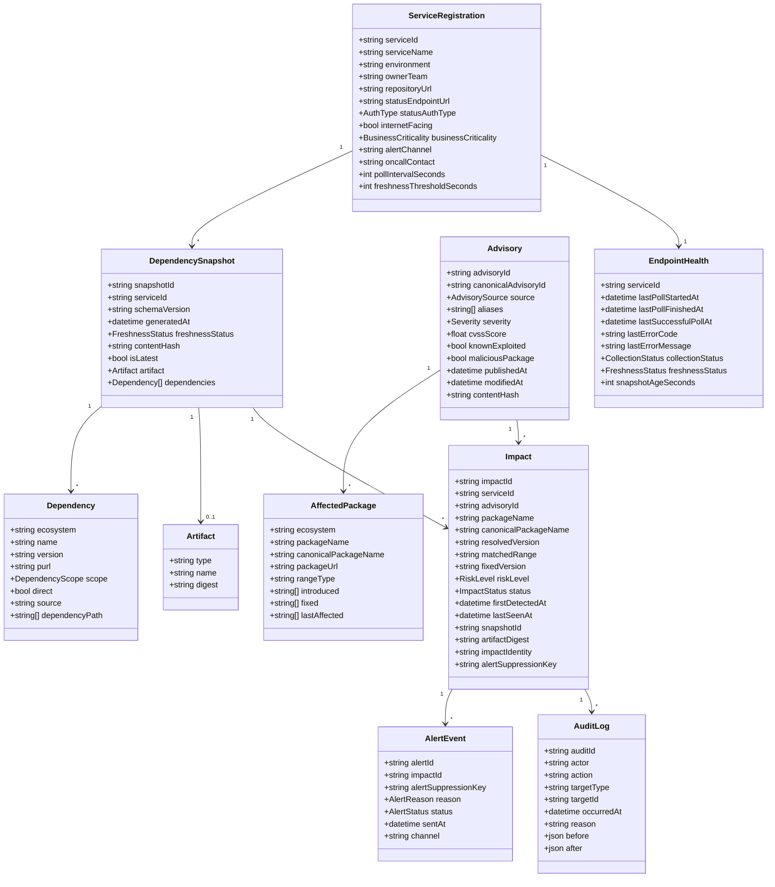
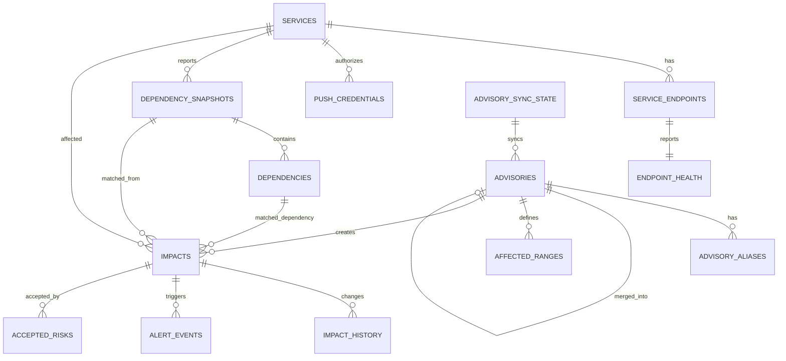

# SCA Monitor Software Design Specification

## 1. 문서 목적

이 문서는 SCA Monitor의 소프트웨어 설계를 정의한다.

SCA Monitor는 클라우드에 별도로 운영되는 중앙 alert 서버가 각 서비스의 dependency status endpoint 또는 snapshot push API를 통해 설치 라이브러리 정보를 수집하고, 외부에 이미 보고된 보안 이슈와 매칭하여 영향받는 서비스를 식별하고 alert을 발송하는 시스템이다.

이 시스템은 패키지 코드나 행위를 직접 분석하여 악성 여부를 새로 판정하지 않는다.
OSV, GitHub Security Advisory, NVD, CISA KEV, OpenSSF malicious package 등 신뢰 가능한 외부 소스에 보고된 이슈를 기준으로 서비스 영향도를 계산한다.

## 2. 설계 범위

### 포함 범위

- 서비스 등록 및 ownership 관리
- dependency status endpoint 등록 및 인증 정보 관리
- endpoint polling 및 dependency snapshot 저장
- 서비스 또는 CI/CD pipeline의 snapshot push 수신
- endpoint schema validation
- snapshot freshness 판정
- 외부 advisory source 동기화
- advisory 변경 감지 및 재매칭
- package ecosystem, name, version range 기반 영향도 매칭
- risk level 산정
- alert deduplication 및 escalation
- impact 상태 관리
- 자동 fixed 판정
- 운영 감사 로그
- 웹 기반 사용자 콘솔을 통한 서비스 등록, 모니터링, 조치 관리

### 제외 범위

- 패키지 코드 정적 분석
- 악성 스크립트 직접 판정
- obfuscation 탐지
- maintainer 계정 탈취 추정
- 자체 malware classification
- 자체 CVE 발굴

## 3. 용어

| 용어 | 설명 |
|---|---|
| CSCI | Computer Software Configuration Item. 독립 배포 또는 주요 책임 단위의 소프트웨어 구성 항목 |
| CSC | Computer Software Component. CSCI 내부의 주요 기능 컴포넌트 |
| CSU | Computer Software Unit. CSC 내부의 구현 단위 |
| Advisory | 외부 보안 소스에 보고된 취약점 또는 악성 패키지 정보 |
| Dependency Snapshot | 특정 시점에 서비스가 보고한 설치 라이브러리 목록 |
| Impact | 특정 advisory가 특정 서비스의 특정 dependency에 영향을 주는 매칭 결과 |
| Freshness | snapshot이 현재 배포 상태를 대표할 수 있는 시간적 신뢰도 |
| Dedupe Key | 중복 alert 발송을 막기 위한 impact 식별 키 |
| PURL | package-url 표준 식별자. 예: `pkg:npm/lodash@4.17.20` |
| Web Console | 사용자가 서비스 등록, 모니터링, impact 조치, 설정 관리를 수행하는 프론트엔드 |

## 4. 요구사항

### 4.1 기능 요구사항

| ID | 요구사항 |
|---|---|
| FR-001 | 시스템은 서비스를 등록하고 `service_id`, 환경, owner, alert channel, endpoint URL, 인증 방식, 중요도를 저장해야 한다. |
| FR-002 | 시스템은 등록된 서비스의 dependency status endpoint를 주기적으로 polling해야 한다. |
| FR-003 | 시스템은 서비스 또는 CI/CD pipeline이 dependency snapshot을 push할 수 있는 API를 제공해야 한다. |
| FR-004 | 시스템은 dependency snapshot의 `schema_version`을 검증해야 한다. |
| FR-005 | 시스템은 snapshot의 필수 필드인 `service_id`, `schema_version`, `environment`, `generated_at`, dependency의 ecosystem/name/version을 검증해야 한다. |
| FR-006 | 시스템은 endpoint 인증 실패, 연결 실패, 응답 스키마 오류를 endpoint 상태로 저장해야 한다. |
| FR-007 | 시스템은 endpoint 수집 상태(`ok`, `unreachable`, `auth_failed`, `invalid_response`)와 snapshot freshness(`fresh`, `stale`)를 분리하여 관리해야 한다. |
| FR-008 | 시스템은 dependency와 advisory affected package를 ecosystem별 canonical name, package name, version, purl, scope, direct 여부, dependency path 기준으로 정규화해야 한다. |
| FR-009 | 시스템은 OSV advisory를 feed-sync 방식으로 동기화해야 한다. |
| FR-010 | 시스템은 CISA KEV catalog를 동기화해야 한다. |
| FR-011 | 시스템은 GitHub Security Advisory와 NVD CVE를 확장 소스로 동기화할 수 있어야 한다. |
| FR-012 | 시스템은 advisory의 `modified_at` 또는 content hash 변경을 감지해야 한다. |
| FR-013 | advisory 변경 시 각 서비스-환경의 latest snapshot과 관련 impact를 재매칭해야 한다. |
| FR-014 | 시스템은 dependency의 ecosystem, package name, resolved version이 advisory affected range에 포함되는지 판단해야 한다. |
| FR-015 | 시스템은 service impact를 생성하고 advisory, package, version, snapshot, artifact digest, risk level, 상태를 저장해야 한다. |
| FR-016 | 시스템은 advisory severity, KEV 여부, malicious package 여부, 환경, dependency scope, internet-facing 여부, 서비스 중요도, snapshot 상태, fix availability를 기준으로 risk level을 산정해야 한다. |
| FR-017 | 시스템은 impact identity와 alert suppression key를 분리하고, 같은 suppression key에 대해 동일 alert을 반복 발송하지 않아야 한다. |
| FR-018 | 시스템은 risk level 상승, KEV 등재, malicious flag 추가, SLA 만료, regression 발생 시 재알림해야 한다. |
| FR-019 | 시스템은 Slack 또는 webhook으로 alert을 발송해야 한다. |
| FR-020 | 시스템은 impact 상태를 `open`, `acknowledged`, `in_progress`, `fixed`, `not_affected`, `accepted_risk`, `false_positive`, `resolved_by_advisory_update`로 관리해야 한다. |
| FR-021 | 시스템은 새 snapshot 수집 시 기존 open impact가 fixed 되었는지 자동 판정해야 한다. |
| FR-022 | 시스템은 risk level별 SLA를 계산하고 초과 시 escalation해야 한다. |
| FR-023 | 시스템은 accepted risk 처리 시 승인자, 사유, 만료일을 기록해야 한다. |
| FR-024 | 시스템은 보안 및 운영 이벤트에 대한 audit log를 남겨야 한다. |
| FR-025 | 시스템은 impact, advisory, service, endpoint 상태를 조회할 수 있는 API를 제공해야 한다. |
| FR-026 | 시스템은 Medium 이하 또는 비운영 환경 이슈를 Daily Digest로 묶어 발송할 수 있어야 한다. |
| FR-027 | 시스템은 OSV, GHSA, NVD, KEV, OpenSSF에서 수집한 동일 취약점을 alias 기준으로 canonical advisory에 병합해야 한다. |
| FR-028 | 시스템은 alert candidate를 DB outbox에 기록하고 별도 worker가 발송하여 alert 유실을 방지해야 한다. |
| FR-029 | 시스템은 웹 콘솔에서 서비스 등록, endpoint 설정, push credential 발급, alert channel 설정을 수행할 수 있어야 한다. |
| FR-030 | 시스템은 웹 콘솔에서 전체 보안 현황, 서비스별 risk, open impact, endpoint health, advisory sync 상태를 모니터링할 수 있어야 한다. |
| FR-031 | 시스템은 웹 콘솔에서 impact 상세, dependency 경로, advisory 근거, fixed version, 조치 이력을 확인할 수 있어야 한다. |
| FR-032 | 시스템은 웹 콘솔에서 impact 상태 변경, acknowledge, in progress, accepted risk 요청/승인, false positive, not affected 처리를 수행할 수 있어야 한다. |
| FR-033 | 시스템은 웹 콘솔에서 서비스 등록 가이드와 dependency status endpoint/push API 연동 예시를 제공해야 한다. |
| FR-034 | 시스템은 웹 콘솔에서 조건별 검색과 필터링을 제공해야 한다. 예: service, team, environment, risk, status, advisory, package, KEV 여부, malicious package 여부. |

### 4.2 비기능 요구사항

| ID | 요구사항 |
|---|---|
| NFR-001 | dependency status endpoint는 무인증 공개 인터넷 노출을 전제로 하지 않는다. |
| NFR-002 | 중앙 서버는 bearer token, mTLS, HMAC 중 하나 이상의 endpoint 인증 방식을 지원해야 한다. |
| NFR-003 | endpoint 응답에는 secret, 환경 변수, private registry token이 포함되어서는 안 된다. |
| NFR-004 | 중앙 서버는 등록된 endpoint와 응답의 `service_id`를 검증하여 spoofing을 방지해야 한다. |
| NFR-005 | 수집 신선도 기본값은 prod 1시간, stage 24시간, dev 7일로 설정 가능해야 한다. snapshot 생성 시각은 artifact age 보조 지표로 사용해야 한다. |
| NFR-006 | advisory source 동기화 실패는 별도 운영 alert으로 노출되어야 한다. |
| NFR-007 | alert은 중복 발송을 억제하여 alert fatigue를 줄여야 한다. |
| NFR-008 | schema version 변경에 대해 최소 1개 이전 major version을 일정 기간 지원해야 한다. |
| NFR-009 | 모든 상태 변경은 감사 가능해야 한다. |
| NFR-010 | 시스템은 외부 advisory source 장애 시 기존 advisory DB로 매칭을 계속 수행해야 한다. |
| NFR-011 | push payload의 `service_id`와 `environment`는 push credential에 바인딩된 값과 일치해야 한다. |
| NFR-012 | 관리 API는 인증된 principal과 역할 기반 인가를 사용해야 하며, 승인자 필드는 클라이언트 입력이 아니라 서버가 인증 주체에서 결정해야 한다. |
| NFR-013 | 시스템은 advisory sync lag, poll 성공률, 신규 advisory 수집부터 alert 발송까지의 지연, alert 발송 성공률을 운영 메트릭으로 제공해야 한다. |
| NFR-014 | push API는 payload 크기, dependency 개수, 호출 빈도 제한과 멱등 처리 규약을 가져야 한다. |
| NFR-015 | 웹 콘솔은 데스크톱 우선으로 설계하되 모바일에서도 핵심 현황과 alert 상세를 읽고 기본 조치 상태를 변경할 수 있어야 한다. |
| NFR-016 | 웹 콘솔은 역할 기반 UI 제어를 적용해야 하며, 숨김 처리만으로 권한을 대체하지 않고 API 인가와 일치해야 한다. |

## 5. 취약점 및 공격 정보 소스

이 시스템은 자체적으로 취약점이나 악성 패키지를 판정하지 않는다.
따라서 외부에 이미 보고된 advisory, malicious package report, known exploited vulnerability 정보를 정기적으로 수집한다.

### 5.1 확정 가능한 외부 소스

| 소스 ID | 소스 | 수집 대상 | 수집 방법 | 주요 매칭 키 | MVP 여부 | 확인 상태 |
|---|---|---|---|---|---|---|
| SRC-001 | OSV.dev | 오픈소스 package vulnerability, OSV ID, CVE alias, GHSA alias, affected range, fixed version | OSV 데이터 덤프 일괄 import 및 `GET https://api.osv.dev/v1/vulns/{id}` 보강. `querybatch`는 즉시 보조 조회에만 사용 | ecosystem, package name, version, OSV ID, aliases | 필수 | CONFIRMED |
| SRC-002 | CISA KEV | 실제 악용이 확인된 CVE, vendor/product, due date, required action | CISA KEV JSON/CSV catalog feed 수집 | CVE ID | 필수 | CONFIRMED |
| SRC-003 | GitHub Security Advisory | GHSA, CVE alias, ecosystem, package, vulnerable version range, malware advisory | `GET https://api.github.com/advisories` 사용. malware advisory는 `type=malware` 지정 필요 | GHSA ID, CVE ID, ecosystem, package name, version range | 2차 | CONFIRMED |
| SRC-004 | NVD CVE API 2.0 | CVE, CVSS, CWE, CPE, reference, change history | `GET https://services.nvd.nist.gov/rest/json/cves/2.0`, 변경 이력은 `/rest/json/cvehistory/2.0` | CVE ID, CPE, lastModified | 2차 | CONFIRMED |
| SRC-005 | OpenSSF Malicious Packages | 악성 package report, typosquatting, dependency confusion, account takeover, malicious install payload report | OpenSSF malicious-packages repository 또는 OSV API의 `MAL-*` records 수집 | MAL ID, ecosystem, package name, version, OSV format | 필수 | CONFIRMED |

### 5.2 OSV 수집 방식

OSV는 오픈소스 패키지 취약점 매칭의 1차 소스이다.
기본 모델은 OSV advisory를 로컬 DB에 feed-sync한 뒤 dependency snapshot을 로컬 DB 기준으로 매칭하는 방식이다.
이 모델은 외부 API 장애 시에도 기존 advisory DB로 매칭을 계속 수행할 수 있어 NFR-010과 일치한다.

권장 수집 방식:

```text
최초 적재: OSV 데이터 덤프를 ecosystem별로 일괄 import
증분 동기화: modified timestamp 또는 content hash 기준 변경분 갱신
상세 보강: GET https://api.osv.dev/v1/vulns/{OSV_ID}
```

`querybatch`는 신규 snapshot 수집 직후 로컬 DB 반영 전 최신 advisory를 확인하기 위한 보조 경로로만 사용한다.
`querybatch` 결과는 vulnerability id와 modified 정보를 기준으로 로컬 advisory와 병합하고, 상세 정보가 필요한 경우 `GET /v1/vulns/{id}`를 호출한다.

보조 조회 예시:

```http
POST https://api.osv.dev/v1/querybatch
Content-Type: application/json
```

단건 상세 조회:

```http
GET https://api.osv.dev/v1/vulns/{OSV_ID}
```

수집 필드:

```text
id
aliases
summary
details
affected[].package.ecosystem
affected[].package.name
affected[].ranges
affected[].versions
affected[].database_specific
severity
published
modified
references
```

설계 반영:

- OSV ID를 primary advisory ID로 저장한다.
- CVE/GHSA는 aliases로 저장한다.
- affected range는 ecosystem별 version matcher 입력으로 사용한다.
- `modified` 변경 시 advisory 재매칭을 수행한다.
- 로컬 DB에 존재하는 canonical advisory와 alias가 겹치면 신규 row를 만들지 않고 병합한다.

현재 MVP 구현 상태:

- `POST /api/v1/advisories/osv/import`는 `advisory_id`를 받아 `GET https://api.osv.dev/v1/vulns/{id}`로 단건 상세를 수집한다.
- `GET /api/v1/advisories`는 저장된 advisory를 조회한다.
- `GET /api/v1/advisories/{advisory_id}`는 저장된 advisory 상세, affected range/version, raw source payload, 관련 impact 요약을 조회한다.
- `scripts/osv_sync.py`는 OSV ecosystem dump ZIP을 읽어 advisory를 일괄 import한다.
- `advisory_sync_state`는 source별 import 성공/실패 상태, cursor, last run, 처리 건수를 기록한다.
- OSV dump sync worker는 `advisory_sync_state`의 `lock_owner`, `lock_expires_at`을 이용해 source별 중복 실행을 차단한다.
- advisory import는 저장 값 변경 여부를 감지하고, 변경된 advisory package를 포함하는 latest snapshot을 재매칭한다.
- matcher는 `affected[].versions` exact version과 `affected[].ranges[].events`의 introduced/fixed/last_affected/limit 범위를 매칭한다.
- 현재 range matcher는 SemVer-like 비교를 지원하는 MVP 구현이며, ecosystem별 세부 규칙과 pre-release 정책은 후속 보강 대상이다.
- OSV dump sync는 `--limit`, `--scan-limit`, `--dump-url`, `--zip-path` 옵션을 지원하는 worker CLI 단계이다. `--limit`는 import 대상 advisory 수를 제한하고, `--scan-limit`는 bootstrap/canary 실행에서 전체 JSON record 검사량을 제한한다.
- OSV `MAL-*` record는 `source=OpenSSF`, `is_malicious_package=true`로 저장할 수 있으며, `scripts/osv_sync.py --source OpenSSF --malicious-only`는 OSV-format dump에서 malicious package record만 분리 수집한다. OpenSSF canary는 큰 ecosystem dump를 오래 훑지 않도록 `--scan-limit`를 함께 사용할 수 있으며, scan limit에 도달하면 sync 상태는 `partial`로 기록된다.
- `scripts/cisa_kev_sync.py`는 CISA KEV JSON catalog를 읽어 `source=CISA_KEV`, `is_known_exploited=true`, `severity=critical` advisory로 저장하고 `advisory_sync_state`에 sync 상태를 기록한다. KEV `cveID`가 기존 OSV/GHSA raw `aliases`에 있으면 해당 package advisory도 known-exploited critical로 보강하고 latest snapshot을 재매칭한다.
- endpoint polling worker는 등록된 `status_endpoint_url`을 순회해 snapshot을 수집하고, `endpoint_poll_state` DB lease로 중복 실행을 차단한다.
- endpoint polling CLI는 `--iterations`, `--interval-seconds`, `--worker-name`, `--lock-owner`, `--lock-ttl-seconds` 옵션을 지원한다.
- endpoint polling/test는 MVP 범위에서 저장된 bearer token을 `Authorization: Bearer` 헤더로 전달한다. 서비스 조회 API와 Web Console에는 secret 원문을 노출하지 않고 설정 여부만 표시한다.
- 외부 scheduler 배치, alias canonical merge, 재매칭 job queue 분리는 후속 구현 대상이다.

### 5.3 CISA KEV 수집 방식

CISA KEV는 실제 악용 여부를 판단하는 enrichment source이다.
KEV 자체는 package version range를 제공하는 목적이 아니라, CVE가 실제 공격에 악용 중인지 판단하는 우선순위 데이터로 사용한다.

권장 수집 방식:

```text
https://www.cisa.gov/known-exploited-vulnerabilities-catalog
https://www.cisa.gov/sites/default/files/feeds/known_exploited_vulnerabilities.json
```

수집 형식:

```text
JSON
CSV
```

수집 필드:

```text
cveID
vendorProject
product
vulnerabilityName
dateAdded
shortDescription
requiredAction
dueDate
knownRansomwareCampaignUse
notes
```

설계 반영:

- `cveID`가 advisory aliases에 포함되면 `is_known_exploited=true`로 enrichment한다.
- prod service에 영향이 있는 KEV advisory는 Critical로 우선 분류한다.
- KEV 신규 등재 또는 KEV field 변경 시 기존 impact를 재평가한다.

현재 MVP 구현 상태:

- `scripts/cisa_kev_sync.py`는 CISA KEV JSON feed 또는 로컬 JSON fixture를 읽어 `CISA_KEV:{cveID}` advisory row로 저장한다.
- `vendorProject/product`, `requiredAction`, `dueDate`, `knownRansomwareCampaignUse`, `notes`, `cwes`는 `raw_payload`에 보존한다.
- 기존 OSV/GHSA row를 덮어쓰지 않기 위해 source-specific advisory ID를 사용한다.
- 기존 OSV/GHSA raw payload의 `aliases`에 같은 CVE가 있으면 기존 package advisory를 `is_known_exploited=true`, `severity=critical`로 보강하고 기존 package impact를 재평가한다.
- 별도 `advisory_aliases` 테이블은 구현되어 advisory import 시 CVE/GHSA/OSV/MAL alias를 저장하고 advisory list/detail API에 노출한다.
- `scripts/merge_canonical_advisories.py`는 같은 ecosystem/package에서 alias가 겹치는 source별 advisory row를 canonical source priority(OSV, OpenSSF, GHSA, NVD, CISA_KEV) 기준 target row로 병합한다. 병합 시 alias, affected range/version, severity, KEV/malicious flag, 관련 impact FK, audit log를 보존한다.
- impact 생성 시 같은 ecosystem/package에서 alias가 겹치는 advisory는 source 우선순위 기반 canonical advisory key를 `impact_identity`와 `alert_suppression_key`에 사용해 중복 impact/alert 생성을 억제한다.
- `scripts/backfill_canonical_impact_keys.py --dry-run`은 기존 impact와 pending alert suppression key를 canonical advisory key 기준으로 갱신하거나 병합할 후보를 보고한다. `--dry-run`을 빼면 단순 후보는 key를 갱신하고, 이미 같은 canonical identity가 있는 항목은 target impact로 병합한다.
- scheduler 기반 정기 canonical merge는 `sca-monitor-canonical-advisory-merge.timer`로 정의되어 있으며, 대량 재매칭 queue는 FR-027 후속 범위이다.

### 5.4 GitHub Security Advisory 수집 방식

GitHub Security Advisory는 GHSA 및 GitHub-originated advisory를 보강하는 소스이다.
malware advisory는 기본 조회에서 제외될 수 있으므로 별도 파라미터를 사용해야 한다.

권장 호출 방식:

```http
GET https://api.github.com/advisories
Accept: application/vnd.github+json
```

malware advisory 조회:

```http
GET https://api.github.com/advisories?type=malware
Accept: application/vnd.github+json
```

필터 예시:

```text
ghsa_id
cve_id
ecosystem
severity
type=reviewed | malware | unreviewed
modified
published
```

수집 필드:

```text
ghsa_id
cve_id
url
html_url
summary
description
type
severity
source_code_location
identifiers
references
vulnerabilities[].package.ecosystem
vulnerabilities[].package.name
vulnerabilities[].vulnerable_version_range
vulnerabilities[].first_patched_version
published_at
updated_at
withdrawn_at
```

설계 반영:

- GHSA ID를 advisory ID 또는 alias로 저장한다.
- `type=malware` 결과는 `is_malicious_package=true`로 저장한다.
- `updated_at` 또는 content hash 변경 시 재매칭한다.

현재 구현:

- `parse_ghsa_advisory()`는 GitHub Global Security Advisory API 응답의 `ghsa_id`, `severity`, `type`, `vulnerabilities[].package`, `vulnerable_version_range`, `first_patched_version`, `published_at`, `updated_at`을 `AdvisoryImport`로 변환한다.
- `scripts/ghsa_sync.py --limit 100`은 `GET https://api.github.com/advisories`를 조회해 `source=GHSA` advisory row로 저장하고 `advisory_sync_state`에 `GHSA` 상태를 기록한다. `GITHUB_TOKEN`이 있으면 `Authorization: Bearer`로 전달한다.
- `scripts/ghsa_sync.py --type malware --limit 100`은 GitHub malware advisory를 `is_malicious_package=true`로 저장한다.
- `--json-path`는 fixture/staged import 검증에 사용한다.
- GitHub pagination 전체 순회, alias 기반 canonical merge, GraphQL 기반 고급 조회는 후속 범위이다.

### 5.5 NVD CVE API 수집 방식

NVD는 CVE 표준 메타데이터, CVSS, CWE, CPE, reference를 보강하는 소스이다.
오픈소스 package version 매칭은 OSV/GHSA가 더 적합하므로, NVD는 CVE enrichment와 change history 용도로 사용한다.

권장 호출 방식:

```http
GET https://services.nvd.nist.gov/rest/json/cves/2.0
```

CVE ID 기반 조회:

```http
GET https://services.nvd.nist.gov/rest/json/cves/2.0?cveId=CVE-2026-0000
```

변경 이력 조회:

```http
GET https://services.nvd.nist.gov/rest/json/cvehistory/2.0?cveId=CVE-2026-0000
```

수집 필드:

```text
cve.id
cve.sourceIdentifier
cve.published
cve.lastModified
cve.vulnStatus
cve.descriptions
cve.metrics
cve.weaknesses
cve.configurations
cve.references
```

설계 반영:

- CVE alias가 있는 OSV/GHSA advisory에 CVSS, CWE, references를 보강한다.
- CPE 기반 매칭은 OS/package/product 자산까지 확장할 때 사용한다.
- `lastModified` 변경 시 advisory metadata를 갱신한다.

현재 구현:

- `parse_nvd_cve_vulnerability()`는 NVD CVE API 2.0의 `vulnerabilities[].cve` payload에서 CVE ID, English description, CVSS severity, vulnerable CPE match, published/lastModified, CISA exploit marker를 `AdvisoryImport`로 변환한다.
- `scripts/nvd_cve_sync.py CVE-YYYY-NNNN`은 단건 CVE를 NVD에서 조회하거나 `--json-path` fixture를 읽어 `source=NVD`, `ecosystem=cpe` advisory row로 저장하고 `advisory_sync_state`에 `NVD` 상태와 cursor를 기록한다. 같은 CVE alias를 가진 기존 OSV/GHSA/OpenSSF advisory가 있으면 해당 row의 severity를 NVD CVSS 기준으로 상향하고 raw payload의 `_nvd_enrichment`에 CVE/CVSS/CPE/CWE/reference metadata를 기록한 뒤 영향도를 재계산한다.
- `scripts/nvd_cve_sync.py --last-mod-start <ISO8601> --last-mod-end <ISO8601>`는 NVD `lastModStartDate`/`lastModEndDate` window에서 CVE ID 후보를 추출한 뒤 기존 batch sync 경로로 가져온다. 원격 NVD 후보 조회는 `startIndex`/`resultsPerPage` 기반 pagination을 따라 전체 window를 순회하고, page size는 `--modified-results-per-page`로 조절한다. 폐쇄망 또는 fixture 검증은 `--modified-json-path`로 동일 후보 추출 로직을 검증한다.
- `scripts/nvd_cve_sync.py --use-cursor --lookback-hours 24`는 `advisory_sync_state.cursor`에 저장된 NVD lastModified timestamp를 다음 `lastModStartDate`로 사용한다. cursor가 없거나 ISO timestamp가 아니면 lookback window로 시작점을 계산하고, window batch 전체가 성공한 경우에만 `last_mod_end`를 새 cursor로 저장한다.
- `scripts/nvd_cve_sync.py --cve-list-path reported-cves.txt --limit 100`은 newline-delimited CVE 목록을 dedupe한 뒤 순차 처리한다. 원격 NVD API batch 호출은 `--delay-seconds` 또는 `NVD_REQUEST_DELAY_SECONDS`로 요청 간격을 둘 수 있고, batch 전체가 성공한 경우에만 cursor를 마지막 성공 CVE 또는 modified-window watermark로 전진시킨다. 오프라인 검증 또는 staged import는 `--json-dir fixtures/nvd`를 함께 사용하며 파일명은 `CVE-YYYY-NNNN.json` 형식을 따른다.
- VM systemd 배포의 full `enable` 모드에서는 `sca-monitor-nvd-cve-sync.timer`가 6시간 주기로 `--use-cursor --lookback-hours 24 --modified-results-per-page 2000 --limit 100` NVD modified-window sync를 실행한다.
- `/cvehistory/2.0` 변경 이력 수집과 NVD reference/CWE field의 별도 정규화 테이블 projection은 후속 범위이다.

### 5.6 OpenSSF Malicious Packages 수집 방식

OpenSSF Malicious Packages는 악성 패키지 보고 데이터의 핵심 소스이다.
보고서는 OSV format으로 제공되며 OSV API 또는 repository mirror를 통해 수집할 수 있다.

수집 방식:

```text
GitHub repository: https://github.com/ossf/malicious-packages
OSV API: https://api.osv.dev/v1/vulns/{MAL_ID}
```

예시:

```http
GET https://api.osv.dev/v1/vulns/MAL-2025-6812
```

수집 필드:

```text
id
summary
details
affected[].package.ecosystem
affected[].package.name
affected[].versions
references
database_specific
published
modified
```

설계 반영:

- `MAL-*` ID를 malicious package advisory로 저장한다.
- MVP는 OSV-format `MAL-*` record를 `OpenSSF` source로 분류하고 `scripts/osv_sync.py --source OpenSSF --malicious-only`로 ZIP dump 또는 OSV dump에서 수집한다.
- 매칭된 운영 서비스 impact는 Critical로 우선 분류한다.
- fixed version이 없는 경우 제거 또는 대체 패키지 사용을 action으로 제시한다.

### 5.7 REQUIRED: 사용자가 확정해야 하는 소스

다음 항목은 외부 검색만으로 확정할 수 없으므로 프로젝트 또는 조직 정책으로 결정해야 한다.

| REQUIRED ID | 항목 | 필요한 결정 |
|---|---|---|
| REQ-SRC-001 | 내부 서비스 dependency source | 각 서비스가 endpoint polling을 제공할지, CI/CD push를 제공할지, 둘 다 지원할지 결정 필요 |
| REQ-SRC-002 | 내부 package registry | private npm/PyPI/Maven registry가 있다면 registry URL, package namespace, 접근 방식 필요 |
| REQ-SRC-003 | 서비스 catalog | service_id, owner_team, oncall, alert_channel의 authoritative source가 있는지 결정 필요 |
| REQ-SRC-004 | 배포 artifact source | container image digest, release version, deployment environment를 어디서 가져올지 결정 필요 |
| REQ-SRC-005 | Slack/Webhook/Jira endpoint | alert 발송 대상과 인증 방식 결정 필요 |
| REQ-SRC-006 | accepted risk 승인 정책 | 승인자 역할, 만료일 기본값, 재승인 절차 결정 필요 |
| REQ-SRC-007 | commercial threat intelligence | Snyk, Mend, Socket, Checkmarx 등 상용 feed를 사용할지 결정 필요 |
| REQ-SRC-008 | 관리 API 인증/인가 | OIDC, SSO, API key 중 어떤 인증 방식을 사용할지와 `admin`, `service-owner`, `security-approver` 역할 매핑 결정 필요 |
| REQ-SRC-009 | 외부 API key | NVD/GitHub API key를 사용할지와 secret 저장 위치 결정 필요 |

### 5.8 Source 우선순위

MVP의 권장 우선순위는 다음과 같다.

1. OSV API
2. CISA KEV
3. OpenSSF Malicious Packages
4. GitHub Security Advisory
5. NVD CVE API
6. REQUIRED 내부 service catalog 및 dependency snapshot source

OSV와 OpenSSF Malicious Packages는 package/version 기반 매칭에 직접 사용한다.
CISA KEV와 NVD는 CVE enrichment와 risk 우선순위 보강에 사용한다.
GitHub Security Advisory는 GHSA 및 malware advisory 보강에 사용한다.

## 6. 전체 개념도



## 7. CSCI/CSC/CSU 분해

### 7.1 CSCI 목록

| CSCI ID | 이름 | 책임 | 주요 요구사항 |
|---|---|---|---|
| CSCI-001 | SCA Monitor API Server | 외부 API, 관리 API, push API, workflow API 제공 | FR-001, FR-003, FR-020, FR-023, FR-025 |
| CSCI-002 | Snapshot Collection Worker | endpoint polling, 인증, snapshot 수집, freshness 계산 | FR-002, FR-004, FR-005, FR-006, FR-007 |
| CSCI-003 | Advisory Ingestion Worker | 외부 보안 소스 동기화, canonical advisory 병합, advisory 변경 감지 | FR-009, FR-010, FR-011, FR-012, FR-027 |
| CSCI-004 | Matching and Risk Engine | dependency-advisory 매칭, impact 생성, risk 산정, 자동 fixed 판정 | FR-013, FR-014, FR-015, FR-016, FR-021 |
| CSCI-005 | Alert and Escalation Worker | alert suppression, outbox 발송, Daily Digest, SLA escalation, regression alert | FR-017, FR-018, FR-019, FR-022, FR-026, FR-028 |
| CSCI-006 | Persistence Layer | 데이터 저장, 조회, audit log, outbox 저장 | FR-024, FR-025, FR-028, NFR-009 |
| CSCI-007 | SCA Monitor Web Console | 서비스 등록, 모니터링, impact 조치, 운영 설정을 제공하는 프론트엔드 | FR-029, FR-030, FR-031, FR-032, FR-033, FR-034 |

### 7.2 CSC/CSU 구성

| CSCI | CSC | CSU | 설명 |
|---|---|---|---|
| CSCI-001 | CSC-001-01 Service Management | CSU-001-01-01 ServiceController | 서비스 등록/수정/조회 API |
| CSCI-001 | CSC-001-01 Service Management | CSU-001-01-02 ServiceRegistryService | 서비스 메타데이터 검증 및 저장 |
| CSCI-001 | CSC-001-02 Snapshot Push API | CSU-001-02-01 SnapshotPushController | CI/CD 또는 서비스 push 요청 수신 |
| CSCI-001 | CSC-001-02 Snapshot Push API | CSU-001-02-02 PushAuthValidator | push API 인증 검증 |
| CSCI-001 | CSC-001-03 Impact Workflow API | CSU-001-03-01 ImpactController | impact 조회 및 상태 변경 |
| CSCI-001 | CSC-001-03 Impact Workflow API | CSU-001-03-02 RiskAcceptanceService | accepted risk 승인/만료 관리 |
| CSCI-001 | CSC-001-04 Authorization | CSU-001-04-01 RoleAuthorizationService | admin, service-owner, security-approver 역할 검증 |
| CSCI-002 | CSC-002-01 Poll Scheduler | CSU-002-01-01 PollJobScheduler | 서비스별 polling job 예약 |
| CSCI-002 | CSC-002-02 Endpoint Client | CSU-002-02-01 DependencyEndpointClient | endpoint 호출 |
| CSCI-002 | CSC-002-02 Endpoint Client | CSU-002-02-02 EndpointAuthProvider | bearer, mTLS, HMAC 인증 처리 |
| CSCI-002 | CSC-002-03 Snapshot Validation | CSU-002-03-01 SchemaValidator | schema version 및 필수 필드 검증 |
| CSCI-002 | CSC-002-03 Snapshot Validation | CSU-002-03-02 FreshnessEvaluator | freshness 상태 계산 |
| CSCI-002 | CSC-002-04 Snapshot Normalization | CSU-002-04-01 DependencyNormalizer | dependency 정규화 |
| CSCI-002 | CSC-002-04 Snapshot Normalization | CSU-002-04-02 PackageNameCanonicalizer | ecosystem별 package canonical name 생성 |
| CSCI-003 | CSC-003-01 Source Connectors | CSU-003-01-01 OsvConnector | OSV advisory 수집 |
| CSCI-003 | CSC-003-01 Source Connectors | CSU-003-01-02 CisaKevConnector | CISA KEV 수집 |
| CSCI-003 | CSC-003-01 Source Connectors | CSU-003-01-03 GhsaConnector | GHSA 수집 |
| CSCI-003 | CSC-003-01 Source Connectors | CSU-003-01-04 NvdConnector | NVD CVE 수집 |
| CSCI-003 | CSC-003-02 Advisory Normalization | CSU-003-02-01 AdvisoryNormalizer | advisory 공통 모델 변환 |
| CSCI-003 | CSC-003-02 Advisory Normalization | CSU-003-02-02 AdvisoryChangeDetector | modified_at/content hash 변경 감지 |
| CSCI-003 | CSC-003-02 Advisory Normalization | CSU-003-02-03 AdvisoryCanonicalizer | alias 기반 canonical advisory 병합 |
| CSCI-004 | CSC-004-01 Version Matching | CSU-004-01-01 EcosystemVersionRangeMatcher | ecosystem별 version range 판단 |
| CSCI-004 | CSC-004-02 Impact Management | CSU-004-02-01 ImpactMatcher | snapshot과 advisory 매칭 |
| CSCI-004 | CSC-004-02 Impact Management | CSU-004-02-02 ImpactStateResolver | 신규/기존/해결 impact 판정 |
| CSCI-004 | CSC-004-03 Risk Scoring | CSU-004-03-01 RiskScoringService | risk level 산정 |
| CSCI-004 | CSC-004-03 Risk Scoring | CSU-004-03-02 AutoResolutionService | fixed 자동 판정 |
| CSCI-005 | CSC-005-01 Alert Suppression | CSU-005-01-01 AlertSuppressionKeyGenerator | alert suppression key 생성 |
| CSCI-005 | CSC-005-01 Alert Deduplication | CSU-005-01-02 AlertSuppressionService | 중복 발송 억제 |
| CSCI-005 | CSC-005-02 Notification Delivery | CSU-005-02-01 SlackNotifier | Slack 발송 |
| CSCI-005 | CSC-005-02 Notification Delivery | CSU-005-02-02 WebhookNotifier | webhook 발송 |
| CSCI-005 | CSC-005-02 Notification Delivery | CSU-005-02-03 AlertOutboxDispatcher | pending alert event 발송 |
| CSCI-005 | CSC-005-02 Notification Delivery | CSU-005-02-04 DailyDigestScheduler | Daily Digest 집계 및 발송 |
| CSCI-005 | CSC-005-03 SLA Escalation | CSU-005-03-01 SlaEvaluator | SLA 만료 판단 |
| CSCI-005 | CSC-005-03 SLA Escalation | CSU-005-03-02 EscalationRouter | escalation 대상 결정 |
| CSCI-006 | CSC-006-01 Repositories | CSU-006-01-01 ServiceRepository | 서비스 저장소 |
| CSCI-006 | CSC-006-01 Repositories | CSU-006-01-02 SnapshotRepository | snapshot 저장소 |
| CSCI-006 | CSC-006-01 Repositories | CSU-006-01-03 AdvisoryRepository | advisory 저장소 |
| CSCI-006 | CSC-006-01 Repositories | CSU-006-01-04 ImpactRepository | impact 저장소 |
| CSCI-006 | CSC-006-02 Audit | CSU-006-02-01 AuditLogWriter | 감사 로그 기록 |
| CSCI-007 | CSC-007-01 Dashboard UI | CSU-007-01-01 OverviewDashboard | 전체 risk, open impact, endpoint health, sync health 표시 |
| CSCI-007 | CSC-007-02 Service UI | CSU-007-02-01 ServiceListView | 서비스 목록, 필터, 상태 요약 |
| CSCI-007 | CSC-007-02 Service UI | CSU-007-02-02 ServiceRegistrationWizard | 서비스 등록 및 endpoint/push 설정 wizard |
| CSCI-007 | CSC-007-03 Impact UI | CSU-007-03-01 ImpactListView | impact 목록, 검색, 필터 |
| CSCI-007 | CSC-007-03 Impact UI | CSU-007-03-02 ImpactDetailView | advisory 근거, dependency path, 조치 이력 표시 |
| CSCI-007 | CSC-007-03 Impact UI | CSU-007-03-03 ImpactActionPanel | 상태 변경, accepted risk 요청/승인, false positive 처리 |
| CSCI-007 | CSC-007-04 Settings UI | CSU-007-04-01 AlertChannelSettings | Slack/webhook 설정 |
| CSCI-007 | CSC-007-04 Settings UI | CSU-007-04-02 IntegrationGuideView | endpoint/push API 연동 가이드와 예시 표시 |

## 8. 논리 아키텍처



## 9. 행동 다이어그램

### 9.1 Snapshot 수집 행동



### 9.2 Impact 상태 행동



## 10. 시퀀스 다이어그램

### 10.1 Endpoint Polling 기반 수집 및 Alert



### 10.2 Advisory 변경 수집 및 재매칭


### 10.3 자동 Fixed 판정



## 11. 클래스 다이어그램



## 12. 주요 데이터 저장소

| 저장소 | 주요 엔티티 | 설명 |
|---|---|---|
| Service Registry | ServiceRegistration, EndpointAuthConfig | 서비스 메타데이터와 endpoint 인증 정보 |
| Snapshot Store | DependencySnapshot, Dependency, Artifact | 수집된 dependency snapshot 및 정규화 결과 |
| Advisory Store | Advisory, AdvisoryAlias, AffectedRange | 외부 advisory 정규화 데이터 |
| Impact Store | Impact, ImpactHistory | 서비스 영향도 매칭 결과와 상태 이력 |
| Alert Store | AlertEvent, SuppressionRecord | 발송/억제된 alert 이벤트 |
| Audit Store | AuditLog | 상태 변경, 승인, 설정 변경 감사 로그 |

## 13. PostgreSQL 데이터베이스 설계

초기 구현 데이터베이스는 PostgreSQL을 사용한다.
정형 조회와 조인에는 일반 컬럼을 사용하고, 외부 advisory 원문이나 endpoint snapshot 원문처럼 source별 구조 차이가 큰 데이터는 `jsonb`로 저장한다.

### 13.1 설계 원칙

- 모든 주요 테이블은 `uuid` primary key를 사용한다.
- 외부 시스템 식별자는 별도 unique key로 관리한다. 예: `(service_id, environment)`, canonical `advisory_id`, `snapshot_id`.
- 시간 컬럼은 `timestamptz`를 사용한다.
- source 원문 보존이 필요한 데이터는 `raw_payload jsonb`에 저장한다.
- 상태값은 PostgreSQL enum 또는 check constraint로 제한한다.
- endpoint 인증 secret은 평문 저장하지 않고 암호화된 ciphertext와 key reference만 저장한다.
- impact identity와 alert suppression key는 분리한다.
- alert candidate는 DB outbox인 `alert_events`에 `pending` 상태로 먼저 기록하고, 발송 worker가 전송한다.

### 13.2 주요 테이블

#### services

등록된 서비스의 기준 정보이다.

| 컬럼 | 타입 | 설명 |
|---|---|---|
| id | uuid PK | 내부 식별자 |
| service_id | text | 외부/조직 기준 서비스 ID |
| service_name | text | 서비스명 |
| environment | text | `prod`, `stage`, `dev` |
| owner_team | text | 담당 팀 |
| repository_url | text | repository URL |
| runtime_type | text | `node`, `python`, `jvm`, `go` 등 |
| internet_facing | boolean | 인터넷 노출 여부 |
| business_criticality | text | `critical`, `high`, `medium`, `low` |
| alert_channel | text | 기본 alert 채널 |
| oncall_contact | text | on-call 연락처 |
| latest_snapshot_id | uuid nullable FK -> dependency_snapshots.id | 현재 기준 latest snapshot |
| created_at | timestamptz | 생성 시각 |
| updated_at | timestamptz | 수정 시각 |

권장 unique constraint:

```sql
unique (service_id, environment)
```

snapshot 검증 시 응답의 `(service_id, environment)`는 등록된 서비스의 `(service_id, environment)`와 모두 일치해야 한다.

#### service_endpoints

dependency status endpoint와 polling 설정을 저장한다.

| 컬럼 | 타입 | 설명 |
|---|---|---|
| id | uuid PK | 내부 식별자 |
| service_id | uuid FK -> services.id | 서비스 |
| status_endpoint_url | text | dependency status endpoint |
| status_auth_type | text | `bearer_token`, `mtls`, `hmac`, `none` |
| auth_secret_ref | text | 암호화 키 또는 secret manager reference |
| encrypted_auth_config | bytea | 암호화된 인증 설정 |
| poll_interval_seconds | integer | polling 주기 |
| freshness_threshold_seconds | integer | stale 판정 기준 |
| enabled | boolean | polling 활성 여부 |
| created_at | timestamptz | 생성 시각 |
| updated_at | timestamptz | 수정 시각 |

#### push_credentials

snapshot push API 호출 자격증명이다.
토큰 원문은 저장하지 않고 hash만 저장한다.

| 컬럼 | 타입 | 설명 |
|---|---|---|
| id | uuid PK | 내부 식별자 |
| service_id | uuid FK -> services.id | push 가능한 서비스-환경 |
| token_hash | text | push token hash |
| scopes | text[] | 허용 scope. 예: `snapshot:push` |
| expires_at | timestamptz | 만료 시각 |
| revoked_at | timestamptz | 폐기 시각 |
| last_used_at | timestamptz | 마지막 사용 시각 |
| created_at | timestamptz | 생성 시각 |

push payload의 `(service_id, environment)`는 credential에 바인딩된 서비스-환경과 일치해야 한다.

#### hmac_nonces

HMAC 인증 replay 방지를 위한 TTL성 저장소이다.
운영 구현에서는 Redis 같은 cache를 사용할 수 있으나, DB 설계상 저장 구조를 정의한다.

| 컬럼 | 타입 | 설명 |
|---|---|---|
| nonce | text PK | nonce |
| service_id | uuid FK -> services.id | 서비스 |
| expires_at | timestamptz | 만료 시각 |
| created_at | timestamptz | 생성 시각 |

#### endpoint_health

endpoint의 마지막 수집 상태를 저장한다.

| 컬럼 | 타입 | 설명 |
|---|---|---|
| service_endpoint_id | uuid PK/FK -> service_endpoints.id | endpoint |
| last_poll_started_at | timestamptz | 마지막 polling 시작 시각 |
| last_poll_finished_at | timestamptz | 마지막 polling 종료 시각 |
| last_successful_poll_at | timestamptz | 마지막 성공 시각 |
| last_error_code | text | 오류 코드 |
| last_error_message | text | 오류 메시지 |
| collection_status | text | `ok`, `unreachable`, `auth_failed`, `invalid_response` |
| freshness_status | text | `fresh`, `stale` |
| snapshot_age_seconds | integer | snapshot age |
| updated_at | timestamptz | 수정 시각 |

#### dependency_snapshots

서비스가 보고한 dependency snapshot의 header와 원문을 저장한다.

| 컬럼 | 타입 | 설명 |
|---|---|---|
| id | uuid PK | 내부 식별자 |
| snapshot_id | text | 서비스가 제공한 snapshot ID |
| service_id | uuid FK -> services.id | 서비스 |
| schema_version | text | endpoint schema version |
| environment | text | snapshot 환경 |
| generated_at | timestamptz | 서비스가 snapshot을 생성한 시각 |
| collected_at | timestamptz | 중앙 서버가 수집한 시각 |
| source_type | text | `poll`, `push` |
| freshness_status | text | `fresh`, `stale` |
| content_hash | text | 정규화 dependency 목록 hash |
| is_latest | boolean | 서비스-환경의 latest snapshot 여부 |
| last_confirmed_at | timestamptz | 같은 content hash가 마지막으로 확인된 시각 |
| artifact_type | text | `container_image`, `jar`, `lambda`, 기타 |
| artifact_name | text | artifact 이름 |
| artifact_digest | text | image digest 또는 artifact hash |
| raw_payload | jsonb | 원본 snapshot |
| created_at | timestamptz | 생성 시각 |

권장 unique constraint:

```sql
unique (service_id, snapshot_id)
```

동일 서비스-환경에서 latest snapshot은 하나만 허용한다.

```sql
create unique index idx_dependency_snapshots_one_latest
  on dependency_snapshots (service_id)
  where is_latest = true;
```

새로 수집한 snapshot의 `content_hash`가 latest snapshot과 동일하면 새 `dependencies` row를 생성하지 않고 latest snapshot의 `last_confirmed_at`만 갱신할 수 있다.

#### dependencies

정규화된 dependency 목록이다.

| 컬럼 | 타입 | 설명 |
|---|---|---|
| id | uuid PK | 내부 식별자 |
| snapshot_id | uuid FK -> dependency_snapshots.id | snapshot |
| ecosystem | text | `npm`, `PyPI`, `Maven`, `Go`, `crates.io` 등 |
| package_name | text | package 이름 |
| resolved_version | text | 설치된 버전 |
| package_url | text | purl |
| dependency_scope | text | `production`, `development`, `optional`, `transitive` |
| direct_dependency | boolean | direct dependency 여부 |
| dependency_path | text[] | dependency path |
| source | text | lockfile 또는 source |
| created_at | timestamptz | 생성 시각 |

권장 인덱스:

```sql
create index idx_dependencies_lookup
  on dependencies (ecosystem, package_name, resolved_version);

create index idx_dependencies_snapshot
  on dependencies (snapshot_id);

create index idx_dependencies_purl
  on dependencies (package_url);
```

#### advisories

외부 소스에서 수집한 advisory의 공통 header이다.

| 컬럼 | 타입 | 설명 |
|---|---|---|
| id | uuid PK | 내부 식별자 |
| advisory_id | text unique | OSV, GHSA, CVE, MAL 등 source ID |
| canonical_advisory_id | uuid nullable FK -> advisories.id | 병합 대상 canonical advisory |
| source | text | `OSV`, `GHSA`, `NVD`, `CISA_KEV`, `OpenSSF` |
| summary | text | 요약 |
| details | text | 상세 설명 |
| severity | text | `critical`, `high`, `medium`, `low`, `unknown` |
| cvss_score | numeric(3,1) | CVSS |
| published_at | timestamptz | 공개 시각 |
| modified_at | timestamptz | source 수정 시각 |
| ingested_at | timestamptz | 수집 시각 |
| withdrawn_at | timestamptz | 철회 시각 |
| is_known_exploited | boolean | CISA KEV 여부 |
| is_malicious_package | boolean | 악성 패키지 여부 |
| content_hash | text | normalized content hash |
| raw_payload | jsonb | 원본 advisory |

canonicalization 규칙:

- OSV, GHSA, NVD가 같은 CVE/GHSA/OSV alias를 공유하면 하나의 canonical advisory로 병합한다.
- canonical source 우선순위는 현재 impact identity 계산에서 `OSV > OpenSSF > GHSA > NVD > CISA_KEV`이다. 최종 canonical row 병합 정책은 `OSV > GHSA > NVD` 기본 우선순위에 malicious package 우선순위를 함께 반영한다.
- KEV와 NVD는 가능하면 기존 canonical advisory의 enrichment로 반영한다. 현재 NVD sync는 원본 NVD row를 보존하면서 같은 CVE alias의 기존 advisory에 `_nvd_enrichment` metadata와 severity 상향을 적용한다.
- OpenSSF `MAL-*`과 GitHub `type=malware` advisory가 같은 package/version/alias를 가리키면 malicious canonical advisory로 병합한다.
- impact 생성과 alert suppression은 canonical advisory 기준으로 수행한다.

#### advisory_aliases

advisory의 CVE, GHSA, OSV alias를 저장한다.

| 컬럼 | 타입 | 설명 |
|---|---|---|
| id | uuid PK | 내부 식별자 |
| advisory_pk | uuid FK -> advisories.id | advisory |
| alias_type | text | `CVE`, `GHSA`, `OSV`, `MAL` |
| alias_value | text | alias 값 |

권장 unique constraint:

```sql
unique (advisory_pk, alias_value)
```

#### affected_ranges

advisory가 영향을 주는 package와 version range이다.

| 컬럼 | 타입 | 설명 |
|---|---|---|
| id | uuid PK | 내부 식별자 |
| advisory_id | uuid FK -> advisories.id | advisory |
| ecosystem | text | ecosystem |
| package_name | text | package 이름 |
| canonical_package_name | text | ecosystem별 canonical package 이름 |
| package_url | text | purl 또는 purl prefix |
| range_type | text | `SEMVER`, `ECOSYSTEM`, `GIT` |
| version_range | text | affected range expression |
| introduced | text[] | OSV introduced events |
| fixed | text[] | OSV fixed events |
| last_affected | text[] | OSV last_affected events |
| fixed_versions | text[] | fixed version 목록 |
| raw_range | jsonb | source별 range 원문 |

권장 인덱스:

```sql
create index idx_affected_ranges_lookup
  on affected_ranges (ecosystem, canonical_package_name);
```

`range_type='GIT'`는 package version 매칭에 직접 사용하지 않는다.
대신 confidence가 낮은 advisory metadata로 저장하고, repository commit 기반 자산 모델을 도입하기 전까지 impact 자동 생성에서 제외한다.

#### impacts

advisory와 서비스 dependency의 매칭 결과이다.
운영상 가장 중요한 테이블이다.

| 컬럼 | 타입 | 설명 |
|---|---|---|
| id | uuid PK | 내부 식별자 |
| service_id | uuid FK -> services.id | 영향 서비스 |
| advisory_id | uuid FK -> advisories.id | advisory |
| dependency_id | uuid nullable FK -> dependencies.id ON DELETE SET NULL | 매칭 dependency |
| snapshot_id | uuid nullable FK -> dependency_snapshots.id ON DELETE SET NULL | 매칭 snapshot |
| package_name | text | package 이름 |
| canonical_package_name | text | canonical package 이름 |
| resolved_version | text | 영향 버전 |
| matched_range | text | 매칭된 affected range |
| fixed_version | text | 권장 fixed version |
| dependency_scope | text | dependency scope |
| environment | text | 환경 |
| risk_level | text | `critical`, `high`, `medium`, `low`, `info` |
| risk_reason | text | risk 산정 사유 |
| status | text | impact 상태 |
| first_detected_at | timestamptz | 최초 탐지 시각 |
| last_seen_at | timestamptz | 마지막 확인 시각 |
| resolved_at | timestamptz | 해결 시각 |
| freshness_status | text | snapshot freshness |
| artifact_digest | text | artifact digest |
| impact_identity | text | service/environment/advisory/package 기준 identity |
| alert_suppression_key | text | alert 중복 억제 키 |
| created_at | timestamptz | 생성 시각 |
| updated_at | timestamptz | 수정 시각 |

권장 unique constraint:

```sql
unique (impact_identity)
```

기본 impact identity:

```text
service_id
environment
canonical_advisory_id
canonical_package_name
```

`resolved_version`, `artifact_digest`, `snapshot_id`는 최신 관측값으로 갱신하고, 변경 이력은 `impact_history`에 기록한다.
취약 버전이 바뀌었지만 risk 변동이 없으면 기본적으로 alert을 억제하고 Daily Digest 또는 impact detail에서만 노출한다.

권장 인덱스:

```sql
create index idx_impacts_service_status
  on impacts (service_id, status, risk_level);

create index idx_impacts_advisory
  on impacts (advisory_id);

create index idx_impacts_open_sla
  on impacts (status, risk_level, first_detected_at)
  where status in ('open', 'acknowledged', 'in_progress');
```

#### impact_history

impact 상태 변경 이력이다.

| 컬럼 | 타입 | 설명 |
|---|---|---|
| id | uuid PK | 내부 식별자 |
| impact_id | uuid FK -> impacts.id | impact |
| from_status | text | 이전 상태 |
| to_status | text | 변경 상태 |
| actor | text | 변경자 |
| reason | text | 변경 사유 |
| metadata | jsonb | 추가 정보 |
| created_at | timestamptz | 생성 시각 |

#### alert_events

발송 또는 억제된 alert 이벤트이다.

| 컬럼 | 타입 | 설명 |
|---|---|---|
| id | uuid PK | 내부 식별자 |
| impact_id | uuid FK -> impacts.id | impact |
| alert_suppression_key | text | alert suppression key |
| reason | text | `new`, `risk_escalated`, `kev_added`, `sla_expired`, `regression`, `stale_snapshot`, `daily_digest` |
| status | text | `pending`, `sent`, `suppressed`, `failed`, `retrying` |
| channel_type | text | `slack`, `webhook`, `email` |
| channel_target | text | 발송 대상 |
| payload | jsonb | alert payload |
| error_message | text | 실패 메시지 |
| sent_at | timestamptz | 발송 시각 |
| created_at | timestamptz | 생성 시각 |

`alert_events`는 DB outbox 역할을 한다.
impact 생성/변경 트랜잭션 안에서 `pending` row를 생성하고, alert worker가 `FOR UPDATE SKIP LOCKED`로 pending row를 가져와 발송한다.

#### advisory_sync_state

외부 source별 증분 동기화 상태와 rate limit 대응 상태를 저장한다.

| 컬럼 | 타입 | 설명 |
|---|---|---|
| source | text PK | `OSV`, `GHSA`, `NVD`, `CISA_KEV`, `OpenSSF` |
| cursor | text | lastModified watermark 또는 source별 cursor |
| last_run_at | timestamptz | 마지막 실행 시각 |
| last_success_at | timestamptz | 마지막 성공 시각 |
| last_error_message | text | 마지막 오류 |
| records_processed | integer | 마지막 처리 건수 |
| updated_at | timestamptz | 수정 시각 |

connector는 rate limit을 준수하고 지수 백오프를 적용한다.
부분 실패 시 cursor를 전진시키지 않는다. NVD modified-window sync는 ISO timestamp cursor만 watermark로 재사용하고, 잘못된 cursor 값은 lookback fallback window로 대체한다.

#### endpoint_poll_state

endpoint polling worker의 single-active lease와 마지막 실행 결과를 저장한다.

| 컬럼 | 타입 | 설명 |
|---|---|---|
| worker_name | text PK | polling worker lease 이름 |
| status | text | `pending`, `ok`, `partial`, `error` |
| lock_owner | text | 현재 lease 소유자 |
| lock_expires_at | timestamptz | lease 만료 시각 |
| last_success_at | timestamptz | 마지막 성공 또는 부분 성공 시각 |
| last_error_at | timestamptz | 마지막 worker-level 오류 시각 |
| last_error_message | text | 마지막 worker-level 오류 |
| checked_count | integer | 마지막 실행의 확인 endpoint 수 |
| succeeded_count | integer | 마지막 실행의 성공 endpoint 수 |
| failed_count | integer | 마지막 실행의 실패 endpoint 수 |
| snapshots_created_or_updated | integer | 마지막 실행에서 생성 또는 갱신된 impact 수 |
| updated_at | timestamptz | 수정 시각 |

동일 `worker_name`에 대해 lease가 살아 있으면 새 polling 실행은 거부된다.
운영 scheduler는 `lock_ttl_seconds`를 polling 예상 최대 시간보다 크게 설정해야 한다.

#### accepted_risks

accepted risk 승인 정보를 별도 관리한다.

| 컬럼 | 타입 | 설명 |
|---|---|---|
| id | uuid PK | 내부 식별자 |
| impact_id | uuid FK -> impacts.id | impact |
| approved_by | text | 승인자 |
| reason | text | 승인 사유 |
| expires_at | timestamptz | 만료일 |
| revoked_at | timestamptz | 철회일 |
| created_at | timestamptz | 생성 시각 |

#### audit_logs

감사 로그이다.

| 컬럼 | 타입 | 설명 |
|---|---|---|
| id | uuid PK | 내부 식별자 |
| actor | text | 사용자 또는 시스템 actor |
| action | text | 수행 작업 |
| target_type | text | 대상 타입 |
| target_id | text | 대상 ID |
| reason | text | 사유 |
| before | jsonb | 변경 전 |
| after | jsonb | 변경 후 |
| occurred_at | timestamptz | 발생 시각 |

### 13.3 ERD



### 13.4 Partition 및 Retention

초기 MVP에서는 단일 테이블로 시작한다.
운영 데이터가 증가하면 다음 테이블은 월 단위 range partition을 고려한다.

- `dependency_snapshots`
- `dependencies`
- `alert_events`
- `audit_logs`

권장 retention:

| 데이터 | 보존 기간 |
|---|---|
| active service metadata | 삭제 전까지 |
| latest dependency snapshot | 삭제 전까지 |
| historical dependency snapshots | 90일. 단, open impact가 참조 중인 snapshot은 보존하거나 FK를 `ON DELETE SET NULL`로 처리 |
| active/open impacts | 해결 후에도 보존 |
| fixed impacts | 1년 |
| alert events | 1년 |
| audit logs | 3년 또는 조직 정책 |
| advisory data | 삭제하지 않음. withdrawn도 상태로 보존 |

### 13.5 PostgreSQL 확장

권장 확장은 다음과 같다.

```sql
create extension if not exists pgcrypto;
```

`pgcrypto`는 UUID 생성 또는 일부 암호화 보조 기능에 사용할 수 있다.
다만 endpoint 인증 secret은 애플리케이션 레벨 암호화 또는 cloud secret manager 사용을 우선한다.

## 14. Web Console 설계

Web Console은 보안팀과 서비스 담당자가 SCA Monitor를 직접 운영하기 위한 프론트엔드이다.
첫 화면은 마케팅/소개 페이지가 아니라 운영 dashboard이다.

### 14.1 사용자 역할

| 역할 | 주요 권한 |
|---|---|
| admin | 서비스 등록/수정, endpoint 설정, push credential 발급, alert channel 설정 |
| service-owner | 담당 서비스 impact 조회, acknowledge, in-progress, fixed 확인, not affected 근거 제출 |
| security-approver | accepted risk 승인/철회, false positive 확정, escalation 관리 |
| viewer | dashboard와 impact 읽기 전용 조회 |

프론트엔드는 역할별로 가능한 action을 비활성화하거나 숨기되, 최종 권한 판단은 API 서버가 수행한다.

### 14.2 주요 화면

| 화면 | 목적 | 핵심 요소 |
|---|---|---|
| Overview Dashboard | 전체 보안 현황 파악 | Critical/High open count, SLA 초과, endpoint unhealthy, advisory sync lag, 최근 alert |
| Services | 등록 서비스 관리 | 서비스 목록, owner, environment, endpoint health, latest snapshot, open impact count |
| Service Detail | 특정 서비스 상태 확인 | endpoint 설정, latest snapshot, dependency summary, 영향 advisory 목록, poll history |
| Service Registration Wizard | 서비스 등록 지원 | service_id/environment 입력, endpoint polling 또는 push 선택, 인증 방식 설정, 테스트 호출 |
| Impacts | 조치 대상 목록 | risk/status/team/environment/package/advisory/KEV/malicious 필터, bulk acknowledge |
| Impact Detail | 조치 판단 | advisory 요약, affected range, 현재 version, fixed version, dependency path, evidence, history |
| Advisory Detail | advisory 기준 영향 범위 | canonical advisory, aliases, affected packages, 영향 서비스 목록 |
| Settings | 운영 설정 | alert channels, SLA policy, API credentials, role mapping |
| Integration Guide | 서비스 연동 안내 | endpoint schema 예시, push API 예시, curl, CI/CD snippet |

### 14.3 서비스 등록 Wizard

서비스 등록은 사용자가 최소한의 입력으로 성공 여부를 확인할 수 있어야 한다.

단계:

1. 기본 정보 입력: service_id, environment, owner_team, business criticality, internet-facing 여부
2. 수집 방식 선택: endpoint polling 또는 snapshot push
3. endpoint polling 선택 시 URL, 인증 방식, polling 주기, freshness threshold 입력
4. push 선택 시 credential 발급 및 CI/CD 예시 표시
5. schema validation test 실행
6. 첫 snapshot 수집 또는 push 확인
7. 서비스 등록 완료 및 Service Detail로 이동

### 14.4 모니터링 UX

운영자가 가장 먼저 봐야 하는 정보는 다음 순서로 배치한다.

1. 지금 조치해야 할 Critical/High impact
2. SLA 초과 또는 임박 항목
3. endpoint 수집 실패 또는 stale 서비스
4. advisory sync 실패 또는 지연
5. 최근 fixed/regression 이벤트

모바일에서는 Overview, Impact Detail, 기본 상태 변경 action을 우선 지원한다.
대량 설정, 복잡한 필터, wizard는 데스크톱 사용성을 우선한다.

### 14.5 Frontend API 연동

Web Console은 API Gateway를 통해 다음 API를 사용한다.

```text
GET /api/v1/overview
GET /api/v1/session
GET /api/v1/services
POST /api/v1/services
GET /api/v1/services/{service_id}
POST /api/v1/services/{service_id}/endpoint/test
POST /api/v1/services/{service_id}/push-credentials
GET /api/v1/impacts
GET /api/v1/impacts/{impact_id}
PATCH /api/v1/impacts/{impact_id}/status
POST /api/v1/impacts/status
GET /api/v1/advisories/{advisory_id}
GET /api/v1/settings/alert-channels
POST /api/v1/settings/alert-channels
PATCH /api/v1/settings/alert-channels/{channel_id}
GET /api/v1/alert-events
POST /api/v1/alert-events/requeue
POST /api/v1/alert-events/{alert_event_id}/requeue
GET /api/v1/audit-logs
```

조회 API는 pagination, sorting, filtering을 지원해야 한다.
목록 화면은 서버 사이드 필터링을 기본으로 하고, 프론트엔드는 선택된 필터 상태를 URL query로 유지한다.

### 14.6 MVP 구현 상태

현재 Web Console MVP는 정적 frontend와 API 서버를 같은 origin에서 제공한다.

구현 완료:

- Overview dashboard: `GET /api/v1/overview` 기반 service/open impact/critical/high/SLA overdue/endpoint unhealthy count와 alert readiness 요약을 표시한다. alert readiness는 default channel 설정/placeholder 여부, pending/failed/dead-letter outbox count, system alert pending count를 포함한다
- Services: `GET /api/v1/services` 기반 등록 서비스 목록과 open impact count 표시
- Service Detail: `GET /api/v1/services/{service_id}`와 Web Console Services 선택 패널에서 endpoint health, latest snapshot, dependency summary, dependency 목록, service impact를 조회한다
- Service Registration: `POST /api/v1/services` 기반 기본 서비스 등록
- Endpoint Test: `POST /api/v1/services/{service_id}/endpoint/test` 기반 dependency status endpoint 단건 호출, schema/service/environment/dependency 필수 필드 검증, `endpoint_health` 상태 반영. Web Console에서 등록 폼 입력값으로 test action 제공
- Endpoint Poll Worker: `scripts/poll_endpoints.py` 기반 등록된 `status_endpoint_url`을 1회 또는 반복 polling하고, 유효한 endpoint payload를 dependency snapshot으로 저장해 impact 매칭까지 수행. `endpoint_poll_state` DB lease로 중복 실행을 차단
- Endpoint Bearer Auth: Web Console/API에서 `status_auth_type=bearer_token`과 token을 등록하면 endpoint test/polling에서 `Authorization: Bearer` 헤더를 사용. 서비스 조회 응답은 secret 원문을 제거하고 `status_auth_configured`만 표시
- Operational Metrics: `/metrics`에서 service/open impact/critical/high/unhealthy count와 advisory sync ready/initialized/lag/failure, endpoint poll success rate, worker lease acquire failure count, new advisory-to-alert latency, alert delivery success rate, alert outbox pending/dead-letter count, stale service count, DB readiness, migration version, PostgreSQL cutover readiness를 Prometheus text 형태로 노출
- Advisory Sync Failure Alert: advisory source 동기화가 실패하면 `reason='system_advisory_sync_failed'` system alert outbox row를 생성한다. suppression key는 `system:advisory_sync:{source}:failed`로 고정해 같은 source의 active 실패 alert 중복을 억제한다. 같은 source 동기화가 이후 `ok`로 성공하면 active 실패 alert는 `resolved`로 전환하고, 이후 재실패는 새 pending alert로 기록한다
- Advisory Sync Stale Alert: `scripts/evaluate_advisory_sync_freshness.py`는 `advisory_sync_readiness.freshness` 기준으로 stale source를 평가해 `reason='system_advisory_sync_stale'` system alert outbox row를 생성한다. suppression key는 `system:advisory_sync:{source}:stale`이며, source가 다시 fresh가 되면 active stale alert를 `resolved`로 전환한다. VM systemd 배포의 full `enable` 모드에서는 `sca-monitor-advisory-freshness.timer`가 이 평가를 15분 주기로 실행한다
- SLA Evaluation: active impact(`open`, `acknowledged`, `in_progress`)는 risk level별 기본 SLA(critical 24h, high 72h, medium 7d, low/info 30d)를 기준으로 API 응답의 `sla.deadline_at`, `sla.overdue`, `sla.seconds_until_deadline`을 계산한다. Overview와 `/metrics`는 `sla_overdue_impacts`/`sca_monitor_sla_overdue_impacts`를 노출한다. `scripts/evaluate_sla_escalations.py`는 overdue impact에 대해 중복되지 않는 `sla_expired` alert outbox row를 생성한다
- Push Credential: `POST /api/v1/services/{service_id}/push-credentials` 기반 `snapshot:push` token 발급, token hash 저장, service/environment 바인딩 검증. `POST /api/v1/services/{service_id}/push-credentials/{credential_id}/revoke` 기반 revoke와 `POST /api/v1/services/{service_id}/push-credentials/{credential_id}/rotate` 기반 회전을 지원한다. Web Console에서 token을 1회 표시하고 `POST /api/v1/services/{service_id}/status` 기반 Bearer token snapshot push 예시 및 credential rotate/revoke action을 지원
- Alert Channel Settings: `GET/POST/PATCH /api/v1/settings/alert-channels`와 Web Console Settings에서 기본 webhook channel을 등록, 조회, default 전환, disable 처리한다. 채널 목록은 placeholder target 여부와 live dispatcher 차단 상태를 표시한다. `scripts/seed_default_alert_channel.py`는 `SCA_MONITOR_DEFAULT_ALERT_WEBHOOK_URL` 기반으로 cold-start 기본 channel을 생성 또는 갱신하고, 운영 실수를 줄이기 위해 placeholder target을 기본 거부한다. `POST /api/v1/settings/alert-channels/{channel_id}/test`와 Web Console `Test` action은 alert outbox row를 claim/send 처리하지 않고 synthetic payload로 channel 연결성을 검증한다. webhook URL 원문은 조회 응답에 노출하지 않는다
- Alert Event Operations: `GET /api/v1/alert-events`와 Web Console Settings에서 alert event 상태를 status/search/limit/system-only 조건으로 조회하고, pending/dispatching/sent/failed/dead_letter/resolved 상태를 필터링할 수 있다. Web Console은 alert reason, suppression key, payload 요약(source, error, resolved/requeue timestamp 등)과 펼침 가능한 payload 원문을 표시해 system alert의 원인과 해소 이력을 확인하게 한다. dead-letter event는 `POST /api/v1/alert-events/{id}/requeue`, `POST /api/v1/alert-events/requeue`, 또는 `scripts/requeue_alerts.py`로 pending 복구할 수 있으며, Web Console requeue reason 입력값은 audit log와 alert payload의 requeue reason으로 기록된다. Web Console requeue 완료 후 Audit Logs 필터는 `alert_event.requeue`로 갱신되어 운영자가 감사 이력을 바로 확인할 수 있다
- Alert Dispatch Worker: `scripts/dispatch_alerts.py` 기반 pending/failed/expired dispatching alert를 webhook으로 발송하고, 명시적 `--webhook-url`이 없으면 기본 alert channel을 사용한다. webhook에는 `Idempotency-Key`, `X-SCA-Alert-Event-Id`, `X-SCA-Alert-Suppression-Key` 헤더를 포함한다. `--iterations`, `--interval-seconds`, `--lock-owner`, `--lock-ttl-seconds`, `--retry-backoff-seconds`, `--max-retries` 옵션으로 운영 루프 실행과 dead-letter 전환을 지원한다. `scripts/alert_dispatcher_preflight.py`, `GET /api/v1/alerts/dispatcher/preflight`, Web Console Settings의 Dispatcher Preflight는 DB readiness, default webhook channel, placeholder target 여부, dispatcher dry-run 결과를 row update 없이 확인한다. live dispatcher enable 전에는 `scripts/alert_dispatcher_activation_check.py`, `GET /api/v1/alerts/dispatcher/activation-checklist`, Web Console Settings의 Activation Checklist로 DB, default channel, placeholder, dry-run, dead-letter blocking condition을 확인한다. `scripts/alert_dispatcher_go_live_gate.py`는 activation checklist와 systemd unit 상태를 함께 확인하고 live dispatcher 전환 명령을 자동화용 JSON으로 제공한다
- Daily Digest: `scripts/create_daily_digest.py`는 active impact 중 Medium 이하 또는 비운영 환경 이슈를 집계해 `reason='daily_digest'` alert outbox row를 생성한다. digest suppression key는 `daily_digest:{date}:all` 형식으로 하루 1회 중복 생성을 억제하며, 기본 발송 기준 시각은 `Asia/Seoul` 날짜와 systemd `OnCalendar=*-*-* 09:00:00`이다. Web Console Settings와 `POST /api/v1/alerts/daily-digest/preview`는 동일 기준의 dry-run preview를 제공하며 outbox row를 생성하지 않는다
- Snapshot Demo Push: `POST /api/v1/services/{service_id}/status` 기반 dependency snapshot push 검증. 기존 `POST /api/v1/snapshots`는 호환 경로로 유지한다. `SCA_MONITOR_MAX_SNAPSHOT_PAYLOAD_BYTES` 기본 10MB, `SCA_MONITOR_MAX_SNAPSHOT_DEPENDENCIES` 기본 10000개, `SCA_MONITOR_MAX_SNAPSHOT_PUSHES_PER_MINUTE` 기본 분당 30회 제한을 적용해 과대 payload, dependency 폭증, 과도한 push 호출을 거절한다
- Advisory Sync Readiness: `GET /api/v1/overview`는 기존 source별 `advisory_sync` 상태 맵과 별도로 `advisory_sync_readiness`를 제공한다. `OSV`, `CISA_KEV`, `OpenSSF` initial sync가 모두 `ok`이고 `last_success_at`을 가진 경우 `ready`, 일부 실패/부분 실패는 `degraded`, 그 외는 `initializing`으로 표시한다. `advisory_sync_readiness.freshness`는 source별 최신 성공 lag를 `fresh`, `stale`, `partial`, `failed`, `pending`으로 요약하며, stale 기준은 `SCA_MONITOR_ADVISORY_SYNC_STALE_AFTER_SECONDS` 기본 86400초를 사용한다. Web Console Overview는 이 상태와 초기화된 source 수, stale/partial/failed count를 표시한다
- Bootstrap Advisory Sync: `scripts/bootstrap_advisory_sync.py`는 OSV, CISA KEV, OpenSSF malicious package source를 순차 동기화하고 source별 결과, `advisory_sync_readiness`, exit code를 자동화용 JSON으로 제공한다
- Bootstrap Readiness Gate: `scripts/bootstrap_readiness_check.py`는 DB migration/readiness, advisory initial sync readiness, alert dispatcher activation readiness를 read-only로 확인하고 bootstrap 자동화가 사용할 수 있는 JSON 결과와 exit code를 제공한다
- Runtime Migration Control: 기본값은 기존 MVP 호환을 위해 runtime auto-migrate를 수행하지만, PostgreSQL 최소권한 운영에서는 `SCA_MONITOR_AUTO_MIGRATE=false` 또는 `SCA_MONITOR_API_AUTO_MIGRATE`/`SCA_MONITOR_WORKER_AUTO_MIGRATE`로 API/worker 시작 시 DDL 실행을 비활성화하고 배포 migration gate에만 migration 권한을 둘 수 있다
- PostgreSQL Credential Split: `MIGRATION_DATABASE_URL`은 migration owner credential로 DDL/migration smoke를 실행하고, `API_DATABASE_URL`/`WORKER_DATABASE_URL`은 runtime smoke에서 `--skip-migrate`로 검증해 API/worker 최소권한 전환을 지원한다
- PostgreSQL Cutover Readiness Gate: `scripts/postgres_cutover_readiness.py`는 SQLite fallback, shared DB URL, migration/API/worker split credential 조합을 판정하고, `--require-postgres`/`--require-split` 모드에서 PostgreSQL URL, smoke 활성화, runtime auto-migrate 비활성화 조건을 자동화용 JSON과 exit code로 제공한다. `deploy_db_gate.sh`는 `SCA_MONITOR_POSTGRES_REQUIRE_SPLIT=true`일 때 이 split credential 조건을 배포 stop gate로 적용한다
- PostgreSQL Production Preflight: `scripts/postgres_integration_smoke.py --production-preflight --json`은 `MIGRATION_DATABASE_URL`로 migration/write-rollback smoke를 실행하고, `API_DATABASE_URL`/`WORKER_DATABASE_URL`은 migrate 없이 read-only schema smoke로 검증해 실제 전환 전 최소권한 split credential을 한 번에 점검한다. `scripts/postgres_docker_smoke_gate.sh`는 CI/stage에서 Docker 기반 PostgreSQL migration/API workflow smoke를 자동 실행하거나 Docker 미설치 시 mode에 따라 skip/stop 한다
- Database Readiness Console: `/ready`, `GET /api/v1/operations/database-readiness`, Web Console Overview는 DB/migration 상태, credential을 제외한 DB URL source, role별 runtime DB URL source/backend, 현재 PostgreSQL cutover 판정, require-postgres preflight 요약, split credential 준비 여부, 전환 차단 사유를 함께 표시해 FR-030의 운영 모니터링 범위를 DB 전환 상태까지 확장한다. Web Console은 PostgreSQL preflight blocker/warning/ok 수와 next action을 별도 summary로 표시하고, 상세 check를 blocker, warning, passing group으로 나눠 운영자가 cutover 차단 사유를 먼저 확인할 수 있게 한다. `runtime_database_urls`는 `api`, `worker`, `migration` role별 source/backend/configured 여부만 노출하고 URL 원문, host, username, password를 노출하지 않는다. `SCA_MONITOR_POSTGRES_REQUIRE_SPLIT=true`가 설정되면 readiness 요약도 split credential 강제 조건을 반영한다
- Canonicalization Status Console: `GET /api/v1/operations/canonicalization`과 Web Console Overview는 canonical advisory row merge dry-run 후보와 impact key backfill dry-run 후보를 요약해 FR-027 drift를 운영자가 확인할 수 있게 한다. `POST /api/v1/operations/canonicalization/apply`와 Overview의 admin-only action은 advisory row merge와 impact key backfill을 순차 적용하고 audit log를 남긴다
- Canonical Impact Backfill/Merge: `scripts/backfill_canonical_impact_keys.py`는 기존 impact identity와 alert suppression key를 canonical advisory key 기준으로 dry-run/apply 할 수 있다. alias 수집 순서 때문에 동일 canonical identity로 legacy impact와 target impact가 공존하는 경우 target impact로 alert event, impact history, accepted risk를 이관하고 source impact를 삭제해 FR-027 canonicalization drift를 정리한다
- Canonical Advisory Row Merge: `scripts/merge_canonical_advisories.py`는 alias가 겹치는 OSV/GHSA/NVD/OpenSSF/CISA_KEV advisory row를 canonical source priority 기준 target row로 병합하고, apply 후 기본적으로 impact canonical backfill을 이어서 실행한다. VM systemd 배포에서는 `sca-monitor-canonical-advisory-merge.timer`가 advisory sync jobs 이후 1시간 주기로 실행되도록 unit을 생성한다
- Impact List: `GET /api/v1/impacts` 기반 risk/status/advisory/fixed version 표시
- Impact Filters: `GET /api/v1/impacts`의 `status`, `risk_level`, `service_id`, `owner_team`, `environment`, `package_name`, `advisory_id`, `known_exploited`, `malicious_package`, `q` 서버 사이드 필터와 `limit`, `offset`, `sort`, `direction` pagination/sorting 제공. Web Console은 status/risk/service/team/environment/package/advisory/KEV/malicious/search/sort/page size 필터와 URL query 유지, Prev/Next 이동을 제공
- Impact Detail: `GET /api/v1/impacts/{impact_id}` 기반 service, package, advisory, affected range, fixed version, freshness, detection timestamp, alert key, 상태 변경 이력 표시
- Impact Action Panel: `PATCH /api/v1/impacts/{impact_id}/status` 기반 `open`, `acknowledged`, `in_progress`, `fixed`, `accepted_risk`, `false_positive`, `not_affected` 상태 변경 및 reason 기록. `accepted_risk` 전환 시 reason과 expires_at을 필수로 받고 `accepted_risks`에 승인자/사유/만료일을 저장한다. `scripts/expire_accepted_risks.py`는 만료된 accepted risk를 `open`으로 되돌리고 impact history와 audit log를 기록한다
- Impact Bulk Action: `POST /api/v1/impacts/status`와 Web Console bulk action bar에서 현재 impact 필터에 매칭된 항목을 `acknowledged`, `in_progress`, `fixed`, `false_positive`, `not_affected` 등 승인 만료일이 필요 없는 상태로 일괄 변경하고 각 impact history/audit log를 기록한다
- Audit Log: `audit_logs` table과 `GET /api/v1/audit-logs` 기반 impact status 변경, alert channel 설정 변경, alert event requeue 이력을 actor/action/target/reason/before/after로 조회한다. Web Console Settings에서 action/target/search/limit 필터로 최근 audit log를 확인할 수 있으며, webhook URL 같은 민감 target 값은 masked 값만 저장/노출한다
- Advisory Detail: `GET /api/v1/advisories/{advisory_id}`와 Web Console Advisories 화면에서 advisory source, severity, affected version/range, alias, KEV/malicious 여부, 관련 impact 요약을 확인한다
- Role-aware Session/UI: `GET /api/v1/session`으로 현재 `auth_mode`, principal, roles, owner teams, Web Console capability를 조회한다. `SCA_MONITOR_AUTH_MODE=disabled`에서는 기존 MVP 호환을 위해 모든 콘솔 action을 허용하고, `header` 모드에서는 `X-SCA-Principal`, `X-SCA-Roles`, `X-SCA-Owner-Teams` 기반 capability로 서비스 등록, endpoint test, push credential, alert channel, impact status, accepted risk action을 비활성화한다. 최종 권한 판단은 API 서버의 role authorization이 수행한다
- Open impact count: MVP에서는 `open`, `acknowledged`, `in_progress` 상태를 active work로 집계하고 `fixed`, `accepted_risk`, `false_positive`, `not_affected`, `resolved_by_advisory_update`는 open count에서 제외

남은 구현:

- OIDC/JWT 검증과 인증 프록시 연동
- accepted risk 운영 scheduler enable/start
- 외부 endpoint polling scheduler 배치 enable, mTLS/HMAC endpoint auth policy, push credential rotation policy 고도화
- Slack app 방식, alert channel hard delete

### 14.7 UI 상태

각 주요 화면은 다음 상태를 제공한다.

- loading
- empty
- partial data
- error
- permission denied
- stale data warning

endpoint health나 advisory sync가 실패해도 전체 dashboard가 빈 화면이 되면 안 된다.
부분 실패 상태를 화면에 표시하고 정상 수집된 데이터는 계속 보여준다.

## 15. 인터페이스 설계

### 15.1 Dependency Status Endpoint

서비스가 중앙 alert 서버에 제공하는 endpoint이다.

```http
GET /.well-known/sca/dependencies
Authorization: Bearer <token>
```

응답 필수 필드:

```json
{
  "schema_version": "1.0",
  "service_id": "payment-api",
  "environment": "prod",
  "generated_at": "2026-06-10T10:20:30Z",
  "dependencies": [
    {
      "ecosystem": "npm",
      "name": "lodash",
      "version": "4.17.20"
    }
  ]
}
```

### 15.2 Snapshot Push API

endpoint 공개가 어려운 서비스 또는 CI/CD pipeline이 중앙 서버로 snapshot을 push한다.

```http
POST /api/v1/services/{service_id}/status
Authorization: Bearer <token>
Content-Type: application/json
```

요청 body는 dependency status endpoint 응답 schema와 동일하되 `service_id`는 URL path의 `{service_id}`를 기준으로 고정한다.
body에 `service_id`가 포함되어 있으면 path 값과 일치해야 하며, 일치하지 않으면 400 Bad Request를 반환한다.
기존 호환 경로인 `POST /api/v1/snapshots`도 유지하지만 신규 연동 가이드와 push credential 사용 예시는 service-scoped status endpoint를 기본으로 사용한다.

입력 제한:

```text
max_payload_size: 10MB
max_dependencies_per_snapshot: 10000
rate_limit: service credential별 분당 30회
```

멱등 규약:

- 동일 `(service_id, environment, snapshot_id)`와 동일 `content_hash`가 다시 들어오면 200 OK로 처리하고 `last_confirmed_at`만 갱신한다.
- 동일 `(service_id, environment, snapshot_id)`이나 `content_hash`가 다르면 409 Conflict를 반환한다.
- payload의 `(service_id, environment)`가 push credential에 바인딩된 값과 다르면 403 Forbidden을 반환한다.
- service-scoped status endpoint는 path의 `{service_id}`와 body의 `service_id` 불일치를 400 Bad Request로 거절해 service spoofing 가능성을 줄인다.

### 15.3 Impact Workflow API

```http
GET /api/v1/impacts?service_id=payment-api&status=open
PATCH /api/v1/impacts/{impact_id}/status
```

상태 변경 요청 예시:

```json
{
  "status": "accepted_risk",
  "reason": "Compensating control exists",
  "expires_at": "2026-07-10T00:00:00Z"
}
```

`approved_by`는 request body로 받지 않는다.
서버가 인증된 principal과 역할 검증 결과를 기준으로 저장한다.
`accepted_risk` 처리는 `security-approver` 역할만 수행할 수 있으며, `service-owner`는 자기 서비스 impact의 acknowledge와 in-progress 전환만 수행할 수 있다.

현재 MVP는 `SCA_MONITOR_AUTH_MODE=header`에서 trusted gateway가 주입한 `X-SCA-Principal`, `X-SCA-Roles`, `X-SCA-Owner-Teams` 헤더를 기준으로 impact workflow API와 주요 관리 API의 role-aware 인가를 수행한다.
이 모드에서 서버는 request body의 `actor`를 신뢰하지 않고 인증 principal을 `actor`와 accepted risk `approved_by`로 저장한다.
`accepted_risk` 처리는 `security-approver` 역할만 허용하고, `service-owner`는 `X-SCA-Owner-Teams`에 포함된 자기 팀 impact의 `acknowledged`, `in_progress` 전환만 수행할 수 있다.
서비스 등록, endpoint test, push credential 발급/폐기, alert channel 생성/수정은 `admin` 역할만 수행할 수 있다.
OIDC/JWT 검증과 운영 scheduler 등록은 후속 구현 범위이다.

## 16. Version Matching and Package Normalization

MVP에서 자동 version range 매칭을 지원하는 ecosystem은 다음으로 제한한다.

| Ecosystem | 패키지명 정규화 | 버전 매칭 정책 |
|---|---|---|
| npm | scoped package를 보존하고 package name은 소문자 비교 | semver range |
| PyPI | PEP 503 normalization. 대소문자 무시, `-`, `_`, `.` 동치 처리 | PEP 440 |
| Maven | `groupId:artifactId` 형태로 canonicalize하고 소문자 비교 | Maven comparable version |
| Go | module path canonical string 비교 | Go module semantic version 및 pseudo-version |

dependency snapshot과 advisory affected package는 모두 같은 canonicalization 함수를 통과한 뒤 비교한다.
가능하면 `package_url`을 canonical key로 사용하고, purl이 없거나 source별 purl 표기가 다른 경우 ecosystem별 canonical package name으로 fallback한다.

OSV affected range 처리:

- `SEMVER`와 `ECOSYSTEM` range는 ecosystem별 matcher로 평가한다.
- `GIT` range는 package version 기반 자동 매칭에서 제외한다.
- `introduced`, `fixed`, `last_affected`, `limit` event는 원문 순서를 보존한다.

버전 파싱 실패 정책:

- 파싱 실패는 false negative를 피하기 위해 `match_with_low_confidence`로 처리한다.
- alert에는 `confidence=low`와 파싱 실패 사유를 포함한다.
- 동일 케이스는 golden test fixture로 추가한다.

품질 활동:

- npm, PyPI, Maven, Go별 version range golden test set을 유지한다.
- edge case에는 pre-release, epoch, Maven qualifier, Go pseudo-version을 포함한다.

## 17. Risk 산정 설계

초기 구현은 결정적 rule-based scoring으로 시작한다.

Severity 매핑:

| 입력 severity | base risk |
|---|---|
| CVSS >= 9.0 또는 source severity critical | Critical |
| CVSS >= 7.0 또는 source severity high | High |
| CVSS >= 4.0 또는 source severity medium | Medium |
| CVSS < 4.0 또는 source severity low | Low |
| unknown | Medium |

소스 간 severity가 충돌하면 다음 우선순위를 사용한다.

```text
GHSA severity > NVD CVSS > OSV severity vector 계산값 > source unknown 기본값
```

Risk level은 다음 순서로 계산한다.

1. base risk를 severity 매핑으로 결정한다.
2. override를 적용한다.
   - malicious package가 운영 서비스에 매칭되면 Critical 확정
   - CISA KEV가 운영 서비스에 매칭되면 Critical 확정
3. override가 없으면 modifier를 계산한다.
   - `internet_facing=true`: +1
   - `business_criticality=critical`: +1
   - `environment in (stage, dev)`: -1
   - `dependency_scope=development`: -1
4. modifier는 누적하되 최종 이동 폭은 최대 +1, 최소 -1로 제한한다.
5. KEV 또는 malicious package는 어떤 경우에도 High 미만으로 내리지 않는다.
6. 수집 신선도와 snapshot 나이는 risk level을 바꾸지 않고 `confidence`와 `risk_reason`에만 반영한다.
7. fix version 없음은 risk를 자동으로 Critical로 올리지 않고 `remediation_difficulty=no_fix_available`로 표시한다.

최종 `risk_level`, `confidence`, `risk_reason`, `remediation_difficulty`를 impact에 저장한다.

## 18. Alert 설계

### 18.1 Impact Identity와 Alert Suppression Key

```text
impact_identity =
service_id
environment
canonical_advisory_id
canonical_package_name
```

```text
alert_suppression_key =
impact_identity
last_alerted_risk_level
last_alerted_status
```

`artifact_digest`, `resolved_version`, `snapshot_id`는 alert suppression key에 포함하지 않는다.
배포만 반복되고 취약 상태가 변하지 않으면 alert을 재발송하지 않기 위함이다.

### 18.2 재알림 조건

- risk level 상승
- CISA KEV 등재
- malicious package flag 추가
- fixed 이후 regression 발생
- SLA 만료
- stale snapshot 장기 지속

### 18.3 Alert Payload

```json
{
  "impact_id": "4f87e4e2-3df9-4de4-8f4d-2017e0f8f44d",
  "impact_url": "https://sca.example.com/impacts/4f87e4e2-3df9-4de4-8f4d-2017e0f8f44d",
  "alert_suppression_key": "payment-api:prod:OSV-2026-0001:pkg:npm/example-package",
  "risk_level": "critical",
  "service_id": "payment-api",
  "environment": "prod",
  "package": "example-package",
  "version": "1.0.4",
  "purl": "pkg:npm/example-package@1.0.4",
  "advisory_id": "GHSA-xxxx-yyyy-zzzz",
  "known_exploited": true,
  "malicious_package": false,
  "fixed_version": "1.0.8",
  "freshness_status": "fresh",
  "action": "Upgrade example-package to 1.0.8 or later."
}
```

현재 MVP 구현 상태:

- impact 신규 생성 시 `alert_events`에 `pending` outbox row를 생성한다.
- `scripts/dispatch_alerts.py`는 pending alert를 webhook JSON으로 발송하고 `sent_at`, `status=sent`를 기록한다.
- 발송 실패 시 `status=failed`, `retry_count`, `next_attempt_at`를 기록하고 payload에 `dispatch_error`를 남긴다.
- dispatcher는 per-alert `dispatch_lock_owner`, `dispatch_lock_expires_at`을 사용해 중복 발송을 줄이고 만료된 lock을 재획득한다.
- `--dry-run`은 pending 수만 확인하고 DB row를 변경하지 않는다.
- Slack app 방식, dead-letter 정책, idempotency header는 후속 구현 대상이다.

## 19. 보안 설계

- endpoint 인증 정보는 암호화 저장한다.
- 중앙 alert 서버의 고정 egress IP allowlist를 endpoint 접근 제어에 사용할 수 있다.
- dependency status endpoint 접근 로그를 남긴다.
- endpoint 호출 시 service registry의 endpoint URL과 응답 `service_id`를 검증한다.
- mTLS 사용 시 인증서 subject 또는 SAN과 service registration을 매칭한다.
- HMAC 사용 시 timestamp와 nonce를 포함하여 replay를 방지한다.
- dependency snapshot에는 secret, 환경 변수, token, private registry credential을 포함하지 않는다.
- impact 상태 변경과 accepted risk 승인은 audit log에 남긴다.
- alert channel 설정 변경은 감사 대상이다.
- 관리 API는 인증된 principal과 역할 기반 인가를 사용한다.
- `accepted_risk` 승인자는 request body가 아니라 인증 principal에서 서버가 결정한다.

## 20. 장애 및 예외 처리

| 상황 | 처리 |
|---|---|
| endpoint timeout | endpoint 상태를 `unreachable`로 저장하고 다음 주기에 재시도 |
| endpoint auth 실패 | `auth_failed` 저장 및 owner에게 설정 오류 alert |
| schema validation 실패 | `invalid_response` 저장 및 snapshot 폐기 |
| snapshot stale | 기존 snapshot으로 매칭하되 alert에 stale 경고 포함 |
| advisory source 장애 | 마지막 정상 advisory DB로 매칭 지속 |
| alert 발송 실패 | retry 후 실패 이벤트 저장 |
| alert 발송 worker 중단 | `alert_events.status=pending` outbox row를 재기동 후 재처리 |
| 다중 worker endpoint polling | `FOR UPDATE SKIP LOCKED` 또는 advisory lock 기반 lease로 중복 polling 방지 |
| 외부 API rate limit | 지수 백오프를 적용하고 부분 실패 시 sync cursor를 전진시키지 않음 |
| advisory 철회 | 관련 impact를 `resolved_by_advisory_update`로 전환 가능 |

## 21. 요구사항 추적성

| 요구사항 | 관련 CSCI | 관련 설계 |
|---|---|---|
| FR-001 | CSCI-001, CSCI-006 | Service Management, Service Registry |
| FR-002 | CSCI-002 | Poll Scheduler, Endpoint Client |
| FR-003 | CSCI-001 | Snapshot Push API |
| FR-004, FR-005 | CSCI-002 | Schema Validator |
| FR-006, FR-007 | CSCI-002, CSCI-006 | EndpointHealth, FreshnessEvaluator |
| FR-008 | CSCI-002 | DependencyNormalizer |
| FR-009, FR-010, FR-011 | CSCI-003 | Advisory Connectors |
| FR-012, FR-013 | CSCI-003, CSCI-004 | Change Detector, Impact Matcher |
| FR-014, FR-015 | CSCI-004 | Version Matching, Impact Management |
| FR-016 | CSCI-004 | Risk Scoring Service |
| FR-017, FR-018, FR-019 | CSCI-005 | Alert Deduplication, Notification Delivery |
| FR-020, FR-023 | CSCI-001, CSCI-006 | Impact Workflow API, Audit Log |
| FR-021 | CSCI-004 | AutoResolutionService |
| FR-022 | CSCI-005 | SLA Escalation |
| FR-024, FR-025 | CSCI-001, CSCI-006 | Audit Store, Query APIs |
| FR-026 | CSCI-005 | DailyDigestScheduler |
| FR-027 | CSCI-003 | AdvisoryCanonicalizer |
| FR-028 | CSCI-005, CSCI-006 | AlertOutboxDispatcher, Alert Store |
| FR-029, FR-030 | CSCI-007, CSCI-001 | ServiceRegistrationWizard, OverviewDashboard, Service APIs |
| FR-031, FR-032 | CSCI-007, CSCI-001 | ImpactDetailView, ImpactActionPanel, Impact Workflow API |
| FR-033, FR-034 | CSCI-007, CSCI-001 | IntegrationGuideView, list filtering APIs |
| NFR-001 to NFR-004 | CSCI-001, CSCI-002 | Auth Middleware, EndpointAuthProvider |
| NFR-005 to NFR-010 | CSCI-002 to CSCI-006 | Freshness, Sync Health, Audit, Persistence |
| NFR-011 | CSCI-001, CSCI-006 | PushAuthValidator, Push Credentials |
| NFR-012 | CSCI-001 | RoleAuthorizationService |
| NFR-013 | CSCI-002 to CSCI-005 | Operational Metrics |
| NFR-014 | CSCI-001 | Snapshot Push API |
| NFR-015, NFR-016 | CSCI-007, CSCI-001 | Responsive Web Console, RoleAuthorizationService |

## 22. MVP 구현 순서

1. Service Registry와 dependency status endpoint 등록 API
2. 관리 API 인증/인가와 push credential 모델
3. Web Console 기본 shell, navigation, role-aware layout
4. Service Registration Wizard와 endpoint test UI
5. Snapshot schema v1.0 validator
6. endpoint polling worker와 DB lease
7. snapshot 저장, content hash dedup, 수집 신선도 계산
8. OSV feed-sync connector
9. CISA KEV connector
10. advisory normalization, canonicalization, 변경 감지
11. ecosystem별 package canonicalization
12. ecosystem별 version range matcher
13. latest snapshot 기준 impact 생성 및 risk scoring
14. Overview Dashboard와 Service Detail
15. Impact list/detail/action UI와 workflow API
16. alert outbox와 suppression
17. Slack/webhook notifier
18. Daily Digest
19. 자동 fixed 판정
20. SLA escalation
21. audit log와 운영 메트릭
