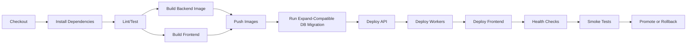

# CI/CD Automation

이 문서는 SCA Monitor 자동화 pipeline 기준을 정의한다.

## 1. Pipeline 목표

CI/CD는 다음을 자동화한다.

- lint
- unit test
- integration test
- frontend build
- backend build
- container image build
- database migration validation
- deployment
- health check
- smoke test
- rollback trigger

## 2. Pipeline Stages



## 3. Required Checks

| 단계 | 실패 시 |
|---|---|
| lint/test 실패 | 배포 중단 |
| image build 실패 | 배포 중단 |
| migration 실패 | 배포 중단 |
| API readiness 실패 | rollback |
| worker health 실패 | rollback 또는 worker 이전 버전 유지 |
| frontend smoke 실패 | frontend rollback |
| smoke test 실패 | 배포 실패 처리 |

기본 CI smoke entrypoint:

```bash
bash scripts/ci_smoke.sh
```

GitHub Actions에서는 `.github/workflows/ci.yml`이 `pull_request`와 `main` push에서 같은 entrypoint를 실행한다.
이 workflow는 PostgreSQL 16 service container를 붙여 `scripts/postgres_integration_smoke.py --with-api-workflow`를 실행하고, public URL smoke는 배포 환경이 아니므로 비활성화한다.
기본 CI smoke는 외부 네트워크 호출 없이 `python3 scripts/advisory_source_preflight.py --list-only --json`으로 advisory source allowlist 계약만 검증한다.
stage/prod 배포 전 실제 outbound 검증은 `python3 scripts/advisory_source_preflight.py --check --json`으로 실행한다.
원격 배포에서 이 검증을 stop gate로 강제하려면 `SCA_MONITOR_ADVISORY_SOURCE_PREFLIGHT=required`를 설정한다.

Docker 기반 PostgreSQL adapter/API workflow smoke를 필수로 강제하려면 다음처럼 실행한다.

```bash
SCA_MONITOR_POSTGRES_DOCKER_SMOKE=required bash scripts/ci_smoke.sh
```

public URL까지 포함한 HTTP smoke를 필수로 강제하려면 다음처럼 실행한다.

```bash
SCA_MONITOR_CI_HTTP_SMOKE=required \
SCA_MONITOR_SMOKE_BASE_URL="$SCA_MONITOR_PUBLIC_URL" \
bash scripts/ci_smoke.sh
```

## 4. Release Inputs

필수 입력:

```text
GIT_SHA
VERSION
ENVIRONMENT
BACKEND_IMAGE
WORKER_IMAGE
FRONTEND_ARTIFACT_OR_IMAGE
MIGRATION_VERSION
```

## 5. Smoke Test Scenarios

Smoke test는 환경별 machine credential을 사용한다.
브라우저 기반 OIDC 로그인에 의존하지 않는다.

필요 secret:

```text
SMOKE_TEST_TOKEN
SMOKE_TEST_SYNTHETIC_SERVICE_ID
SMOKE_TEST_PUSH_TOKEN
```

```text
GET /health
GET /ready
GET /api/v1/operations/cutover-readiness-report
python3 scripts/http_smoke.py --base-url "$SCA_MONITOR_PUBLIC_URL" --json
python3 scripts/http_smoke.py --base-url "$SCA_MONITOR_PUBLIC_URL" --require-postgres-split-metrics --json
python3 scripts/http_smoke.py --base-url "$SCA_MONITOR_PUBLIC_URL" --expect-postgres-split-required "$SCA_MONITOR_EXPECT_POSTGRES_SPLIT_REQUIRED" --json
python3 scripts/http_smoke.py --base-url "$SCA_MONITOR_PUBLIC_URL" --expect-advisory-sync-ready true --json
python3 scripts/http_smoke.py --base-url "$SCA_MONITOR_PUBLIC_URL" --expect-advisory-source-status OSV=ok --expect-advisory-source-status CISA_KEV=ok --expect-advisory-source-status OpenSSF=ok --json
python3 scripts/http_smoke.py --base-url "$SCA_MONITOR_PUBLIC_URL" --expect-cutover-report-status ok --json
python3 scripts/http_smoke.py --base-url "$SCA_MONITOR_PUBLIC_URL" --expect-cutover-report-status blocked --expect-cutover-report-expected-status blocked --require-cutover-report-expectation-met --json
python3 scripts/deployment_input_readiness.py --env-file .env --json
python3 scripts/deployment_input_readiness.py --env-file .env --require-postgres --require-split --json
python3 scripts/db_smoke.py --json
python3 scripts/postgres_cutover_readiness.py --require-postgres --require-split --json
python3 scripts/postgres_integration_smoke.py --production-preflight --json
SCA_MONITOR_POSTGRES_INTEGRATION_SMOKE=required SCA_MONITOR_POSTGRES_REQUIRE_SPLIT=true bash scripts/deploy_db_gate.sh
python3 scripts/postgres_integration_smoke.py --database-url "$SCA_MONITOR_DATABASE_URL" --with-api-workflow --json
SCA_MONITOR_POSTGRES_DOCKER_SMOKE=required bash scripts/postgres_docker_smoke_gate.sh
SCA_MONITOR_SYSTEMD_MODE=validate bash scripts/deploy_systemd_gate.sh
GET /api/v1/overview
GET frontend /
GET frontend static asset
POST /api/v1/services/{service_id}/status with test credential in stage
GET /api/v1/impacts
```

`scripts/ci_smoke.sh`는 기본값으로 `SCA_MONITOR_DEPLOYMENT_ENV_FILE=deploy/sca-monitor.env.example`을 사용해
`scripts/deployment_input_readiness.py`를 실행한다. 배포 자동화가 실제 원격 `.env`를 검증해야 할 때는
`SCA_MONITOR_DEPLOYMENT_ENV_FILE=.env`처럼 명시한다.
운영 승격 단계에서 public URL과 smoke token placeholder까지 stop gate로 강제하려면
`SCA_MONITOR_REQUIRE_RUNTIME_INPUTS=true`를 함께 설정한다.
bootstrap 완료 또는 운영 승격 단계에서 advisory source 초기 동기화까지 강제하려면
`SCA_MONITOR_EXPECT_ADVISORY_SYNC_READY=true`를 설정한다.
초기 bootstrap 중에는 이 값을 설정하지 않아 기본 health/readiness smoke만 수행한다.
특정 source별 상태까지 승격 조건으로 고정하려면 `SCA_MONITOR_EXPECT_ADVISORY_SOURCE_STATUS=OSV=ok,CISA_KEV=ok,OpenSSF=ok`처럼 comma-separated `SOURCE=STATUS` 목록을 설정한다.
GHSA/NVD를 운영 required source로 승격하는 단계에서는 같은 값에 `GHSA=ok,NVD=ok`를 추가한다.
현재 runtime DB backend까지 승격 조건으로 고정하려면 `SCA_MONITOR_EXPECT_DATABASE_BACKEND=sqlite` 또는 `SCA_MONITOR_EXPECT_DATABASE_BACKEND=postgres`를 설정한다.
현재 SQLite fallback 운영 검증은 `sqlite`, PostgreSQL cutover stage 검증은 `postgres`를 사용한다.
cutover readiness report artifact 상태까지 승격 조건으로 고정하려면 `SCA_MONITOR_EXPECT_CUTOVER_REPORT_STATUS=ok` 또는 stage 의도에 맞는 `action_required`/`blocked`를 설정한다.
원격 배포 스크립트 안에서 재시작 후 HTTP smoke를 stop gate로 강제하려면 `SCA_MONITOR_POST_DEPLOY_HTTP_SMOKE=required`를 설정한다.
이 gate는 원격 VM의 `http://127.0.0.1:$SCA_MONITOR_PORT`에 대해 `/health`, `/ready`, `/api/v1/overview`, `/api/v1/operations/cutover-readiness-report`, `/`를 확인하고, 설정된 advisory/database backend 기대값도 함께 검증한다.
원격 배포 중 bootstrap readiness를 stop gate로 연결하려면 `SCA_MONITOR_BOOTSTRAP_READINESS=advisory`를 먼저 사용한다.
이 모드는 advisory/source/readiness 상태를 확인하되 alert dispatcher activation은 제외하므로, 실제 alert target 주입 전 승격 gate로 사용할 수 있다.
advisory source가 초기화된 뒤 freshness stale까지 배포 차단 조건으로 올리려면 `SCA_MONITOR_BOOTSTRAP_READINESS=advisory-freshness`를 사용한다.
alert target seed와 dispatcher activation checklist가 완료된 뒤에는 `SCA_MONITOR_BOOTSTRAP_READINESS=required`로 전환한다.
PostgreSQL secret을 아직 주입하지 않는 배포에서도 split credential 병합 흐름을 검증하려면 `SCA_MONITOR_DATABASE_ENV_DRY_RUN=synthetic`을 사용한다.
실제 원격 secret 파일을 병합하는 승격 단계에서는 `SCA_MONITOR_DATABASE_ENV_DRY_RUN=provided`와 `SCA_MONITOR_DATABASE_ENV_FILE`을 함께 설정해 `.env` 변경 전에 같은 파일을 dry-run gate로 먼저 검증한다.
원격 `.env`에 runtime input을 반영해야 하는 배포에서는 다음처럼 public URL을 주입하고, placeholder smoke token은 원격에서 생성한다.

```bash
SCA_MONITOR_PUBLIC_URL=https://monitoring.fin-ally.net \
SCA_MONITOR_GENERATE_SMOKE_TOKEN=true \
SCA_MONITOR_REQUIRE_RUNTIME_INPUTS=true \
SCA_MONITOR_EXPECT_DATABASE_BACKEND=sqlite \
SCA_MONITOR_EXPECT_ADVISORY_SOURCE_STATUS=OSV=ok,CISA_KEV=ok,OpenSSF=ok \
SCA_MONITOR_EXPECT_CUTOVER_REPORT_STATUS=ok \
SCA_MONITOR_EXPECT_CUTOVER_REPORT_EXPECTED_STATUS=ok \
SCA_MONITOR_POST_DEPLOY_HTTP_SMOKE=required \
SCA_MONITOR_DATABASE_ENV_DRY_RUN=synthetic \
SCA_MONITOR_BOOTSTRAP_READINESS=advisory \
scripts/deploy_remote.sh
```

`SCA_MONITOR_EXPECT_POSTGRES_SPLIT_REQUIRED`는 SQLite fallback/current production에서는 `false`, split credential cutover stage에서는 `true`로 설정한다.

원격 VM 배포에서 systemd unit 설치 단계까지 검증하려면 다음처럼 명시한다.
이 모드는 unit 파일을 설치하지만 API runtime은 기존 nohup 방식을 유지한다.

```bash
SCA_MONITOR_SYSTEMD_MODE=install \
SCA_MONITOR_SYSTEMD_SCOPE=user \
SCA_MONITOR_SYSTEMD_PYTHON=/usr/bin/python3 \
scripts/deploy_remote.sh
```

API service만 systemd runtime으로 canary 전환하려면 다음처럼 실행한다.
worker와 timer는 enable하지 않는다.

```bash
SCA_MONITOR_SYSTEMD_MODE=enable-api \
SCA_MONITOR_SYSTEMD_SCOPE=user \
SCA_MONITOR_SYSTEMD_PYTHON=/usr/bin/python3 \
scripts/deploy_remote.sh
```

endpoint poller까지 canary 전환하려면 다음처럼 실행한다.
alert dispatcher와 timer는 enable하지 않는다.

```bash
SCA_MONITOR_SYSTEMD_MODE=enable-poller \
SCA_MONITOR_SYSTEMD_SCOPE=user \
SCA_MONITOR_SYSTEMD_PYTHON=/usr/bin/python3 \
scripts/deploy_remote.sh
```

alert dispatcher는 실제 webhook 발송 전에 dry-run service로 먼저 canary 전환한다.
이 모드는 pending alert count만 확인하고 row update나 외부 발송을 수행하지 않는다.

```bash
SCA_MONITOR_SYSTEMD_MODE=enable-dispatcher-dry-run \
SCA_MONITOR_SYSTEMD_SCOPE=user \
SCA_MONITOR_SYSTEMD_PYTHON=/usr/bin/python3 \
scripts/deploy_remote.sh
```

advisory 수집 scheduler를 live dispatcher보다 먼저 운영화하려면 다음 중간 단계를 사용한다.
이 모드는 dry-run dispatcher를 유지하면서 advisory freshness, OSV, CISA KEV, GHSA, NVD, OpenSSF, canonical merge timer를 enable/restart한다.
운영 stale 차단 gate까지 함께 쓰려면 OSV/freshness timer를 active unit으로 요구하고, 이후 `SCA_MONITOR_BOOTSTRAP_READINESS=advisory-freshness`로 freshness 상태를 별도 검증한다.

```bash
SCA_MONITOR_SYSTEMD_MODE=enable-advisory-sync-dry-run \
SCA_MONITOR_SYSTEMD_SCOPE=user \
SCA_MONITOR_SYSTEMD_PYTHON=/usr/bin/python3 \
SCA_MONITOR_SYSTEMD_REQUIRE_ACTIVE_UNITS=sca-monitor-osv-npm-sync.timer,sca-monitor-advisory-freshness.timer \
SCA_MONITOR_BOOTSTRAP_READINESS=advisory-freshness \
scripts/deploy_remote.sh
```

full systemd 운영 전환에서 특정 운영 timer까지 실제 활성화되었는지 자동화 gate로 강제하려면 `SCA_MONITOR_SYSTEMD_REQUIRE_ACTIVE_UNITS`를 함께 지정한다.
accepted risk 만료 scheduler를 운영 전환 조건에 포함하는 예시는 다음과 같다.

```bash
SCA_MONITOR_SYSTEMD_MODE=enable \
SCA_MONITOR_SYSTEMD_SCOPE=user \
SCA_MONITOR_SYSTEMD_PYTHON=/usr/bin/python3 \
SCA_MONITOR_SYSTEMD_REQUIRE_ACTIVE_UNITS=sca-monitor-accepted-risk-expiry.timer \
scripts/deploy_remote.sh
```

live dispatcher 전환 전 webhook endpoint 자체는 synthetic payload로 별도 검증한다.
이 단계는 alert outbox row를 claim/send 처리하지 않는다.

```bash
ALERT_WEBHOOK_URL="$ALERT_WEBHOOK_URL" python3 scripts/alert_webhook_smoke.py --json
```

webhook smoke가 통과하면 같은 target을 기본 alert channel로 seed한다.

```bash
SCA_MONITOR_DEFAULT_ALERT_WEBHOOK_URL="$ALERT_WEBHOOK_URL" \
python3 scripts/seed_default_alert_channel.py --json
```

live dispatcher enable 전에는 DB/default channel/dry-run dispatcher activation checklist와 systemd go-live gate를 통과해야 한다.

```bash
python3 scripts/alert_dispatcher_activation_check.py --json
python3 scripts/alert_dispatcher_go_live_gate.py --json
python3 scripts/bootstrap_readiness_check.py --json
```

운영 환경에서는 destructive test를 실행하지 않는다.
prod smoke는 read-only와 synthetic service에 한정한다.
PostgreSQL split credential 전환 pipeline은 `SCA_MONITOR_POSTGRES_REQUIRE_SPLIT=true`를 설정해 shared `SCA_MONITOR_DATABASE_URL` 또는 SQLite fallback이 실수로 승격되지 않도록 한다.

## 6. Rollback Automation

Rollback은 다음 단계를 자동화한다.

1. 이전 image tag 확인
2. API/worker 이전 image 배포
3. frontend 이전 artifact 배포
4. health check
5. smoke test
6. incident note 생성

DB migration rollback은 자동화하지 않는다.
expand/contract 원칙을 지킨 상태에서 image-only rollback을 기본으로 한다.
DB 되돌리기가 필요한 경우 운영자 수동 승인, backup 확인, 영향 분석 이후에만 수행한다.
rollback이 안전하지 않으면 forward fix로 전환한다.
