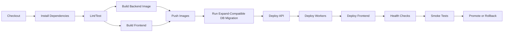

# CI/CD Automation

이 문서는 SCA Monitor 자동화 pipeline 기준을 정의한다.

## 1. Pipeline 목표

CI/CD는 다음을 자동화한다.

- lint
- unit test
- integration test
- frontend build
- backend build
- container image build
- database migration validation
- deployment
- health check
- smoke test
- rollback trigger

## 2. Pipeline Stages



## 3. Required Checks

| 단계 | 실패 시 |
|---|---|
| lint/test 실패 | 배포 중단 |
| image build 실패 | 배포 중단 |
| migration 실패 | 배포 중단 |
| API readiness 실패 | rollback |
| worker health 실패 | rollback 또는 worker 이전 버전 유지 |
| frontend smoke 실패 | frontend rollback |
| smoke test 실패 | 배포 실패 처리 |

## 4. Release Inputs

필수 입력:

```text
GIT_SHA
VERSION
ENVIRONMENT
BACKEND_IMAGE
WORKER_IMAGE
FRONTEND_ARTIFACT_OR_IMAGE
MIGRATION_VERSION
```

## 5. Smoke Test Scenarios

Smoke test는 환경별 machine credential을 사용한다.
브라우저 기반 OIDC 로그인에 의존하지 않는다.

필요 secret:

```text
SMOKE_TEST_TOKEN
SMOKE_TEST_SYNTHETIC_SERVICE_ID
SMOKE_TEST_PUSH_TOKEN
```

```text
GET /health
GET /ready
python3 scripts/http_smoke.py --base-url "$SCA_MONITOR_PUBLIC_URL" --json
python3 scripts/db_smoke.py --json
python3 scripts/postgres_cutover_readiness.py --require-postgres --require-split --json
python3 scripts/postgres_integration_smoke.py --production-preflight --json
python3 scripts/postgres_integration_smoke.py --database-url "$SCA_MONITOR_DATABASE_URL" --with-api-workflow --json
SCA_MONITOR_POSTGRES_DOCKER_SMOKE=required bash scripts/postgres_docker_smoke_gate.sh
SCA_MONITOR_SYSTEMD_MODE=validate bash scripts/deploy_systemd_gate.sh
GET /api/v1/overview
GET frontend /
GET frontend static asset
POST /api/v1/snapshots with test credential in stage
GET /api/v1/impacts
```

원격 VM 배포에서 systemd unit 설치 단계까지 검증하려면 다음처럼 명시한다.
이 모드는 unit 파일을 설치하지만 API runtime은 기존 nohup 방식을 유지한다.

```bash
SCA_MONITOR_SYSTEMD_MODE=install \
SCA_MONITOR_SYSTEMD_SCOPE=user \
SCA_MONITOR_SYSTEMD_PYTHON=/usr/bin/python3 \
scripts/deploy_remote.sh
```

API service만 systemd runtime으로 canary 전환하려면 다음처럼 실행한다.
worker와 timer는 enable하지 않는다.

```bash
SCA_MONITOR_SYSTEMD_MODE=enable-api \
SCA_MONITOR_SYSTEMD_SCOPE=user \
SCA_MONITOR_SYSTEMD_PYTHON=/usr/bin/python3 \
scripts/deploy_remote.sh
```

endpoint poller까지 canary 전환하려면 다음처럼 실행한다.
alert dispatcher와 timer는 enable하지 않는다.

```bash
SCA_MONITOR_SYSTEMD_MODE=enable-poller \
SCA_MONITOR_SYSTEMD_SCOPE=user \
SCA_MONITOR_SYSTEMD_PYTHON=/usr/bin/python3 \
scripts/deploy_remote.sh
```

alert dispatcher는 실제 webhook 발송 전에 dry-run service로 먼저 canary 전환한다.
이 모드는 pending alert count만 확인하고 row update나 외부 발송을 수행하지 않는다.

```bash
SCA_MONITOR_SYSTEMD_MODE=enable-dispatcher-dry-run \
SCA_MONITOR_SYSTEMD_SCOPE=user \
SCA_MONITOR_SYSTEMD_PYTHON=/usr/bin/python3 \
scripts/deploy_remote.sh
```

live dispatcher 전환 전 webhook endpoint 자체는 synthetic payload로 별도 검증한다.
이 단계는 alert outbox row를 claim/send 처리하지 않는다.

```bash
ALERT_WEBHOOK_URL="$ALERT_WEBHOOK_URL" python3 scripts/alert_webhook_smoke.py --json
```

webhook smoke가 통과하면 같은 target을 기본 alert channel로 seed한다.

```bash
SCA_MONITOR_DEFAULT_ALERT_WEBHOOK_URL="$ALERT_WEBHOOK_URL" \
python3 scripts/seed_default_alert_channel.py --json
```

live dispatcher enable 전에는 DB/default channel/dry-run dispatcher activation checklist와 systemd go-live gate를 통과해야 한다.

```bash
python3 scripts/alert_dispatcher_activation_check.py --json
python3 scripts/alert_dispatcher_go_live_gate.py --json
python3 scripts/bootstrap_readiness_check.py --json
```

운영 환경에서는 destructive test를 실행하지 않는다.
prod smoke는 read-only와 synthetic service에 한정한다.

## 6. Rollback Automation

Rollback은 다음 단계를 자동화한다.

1. 이전 image tag 확인
2. API/worker 이전 image 배포
3. frontend 이전 artifact 배포
4. health check
5. smoke test
6. incident note 생성

DB migration rollback은 자동화하지 않는다.
expand/contract 원칙을 지킨 상태에서 image-only rollback을 기본으로 한다.
DB 되돌리기가 필요한 경우 운영자 수동 승인, backup 확인, 영향 분석 이후에만 수행한다.
rollback이 안전하지 않으면 forward fix로 전환한다.
